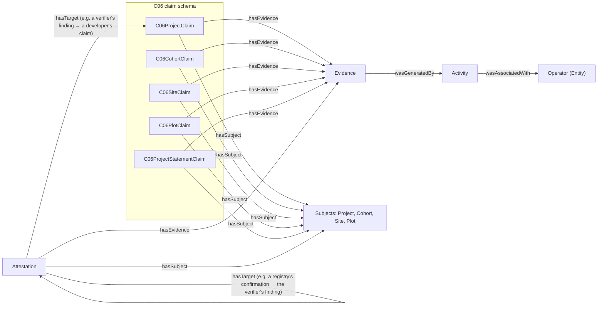
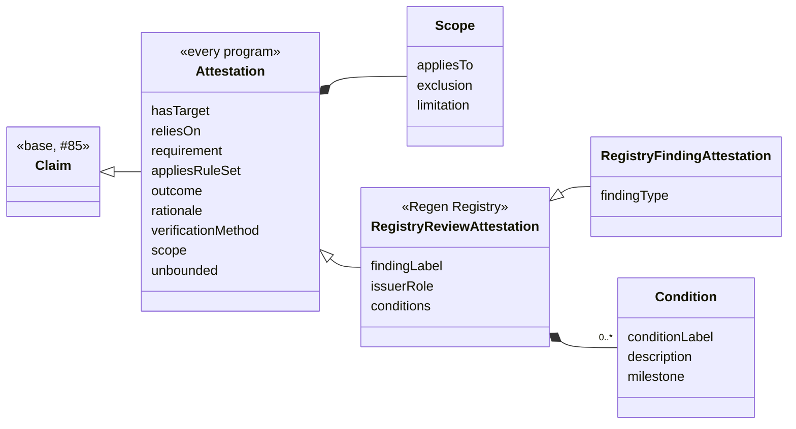

# Attestation, Evidence and the C06 claims

This document describes the schemas added for
[#73 (WP1-06)](https://github.com/regen-network/regen-data-standards/issues/73): the base
[`Attestation`](../schema/src/Attestation.yaml), the Regen Registry review vocabulary
[`RegistryReviewAttestation`](../schema/src/RegistryReviewAttestation.yaml), the full
[`Evidence`](../schema/src/Evidence.yaml) with the [`Activity`](../schema/src/Activity.yaml) that
generated it, the shared terms added to
[`ClaimVocabulary`](../schema/src/ClaimVocabulary.yaml), and the C06 claim schema
[`C06Claim`](../schema/src/C06Claim.yaml). It builds on the base Claim described in
[`docs/claim-base.md`](claim-base.md).

The design was derived from the records of one real registration and validation review, the WP8-01
workflow ([claims#49](https://github.com/regen-network/claims/issues/49)). That evidence is project
data and is kept internally; this document and the examples use synthetic values only.

## How the types relate



| Type | Produced by | Consumed by | Reuse decision |
|---|---|---|---|
| C06 claims | The project developer, as claimant, from its project plan and datasets | Registry review, rule evaluation (WP5), the verifier, auditors, graph queries (WP4), publication (WP7) | New `C06Claim` schema; classes `is_a Claim` |
| C06 subjects | Defined once in the C06 claim schema; IRIs built from the keys the project's records use | Every claim and attestation about them | `is_a ClaimSubject` |
| `Attestation` | Any issuer of a judgment | Review workflows (WP5), verifiers, auditors, Ledger attestation (WP6-01), external mappings (WP7) | `Attestation.yaml` rewritten: `is_a Claim`, program-agnostic |
| `RegistryReviewAttestation` | The Registry Agent, an independent verifier (VVB), the Credit Class Admin | The same | New module; `is_a Attestation` |
| `Evidence` | Whoever cites a source | Reviewers, the resolver (WP6-04), auditors | The #85 skeleton, extended; no subclasses |
| `Activity` | Whoever cites the evidence it generated | Reviewers checking when and by whom evidence was produced | New module; `ProvActivity` mixin |

A project developer's response to a finding is a Claim by the developer (usually a revised C06
claim with new evidence), not an attestation.

`hasTarget` names what an attestation judges or answers: an exact, immutable version of a claim, of
another attestation, or of a snapshot (a fixed set of claim versions, identified by its SnapshotIRI,
[claims#56](https://github.com/regen-network/claims/issues/56)). A snapshot is the target when a
judgment covers a whole submission, such as a registration determination. `hasTarget` never names a
logical label: a finding that runs over several review rounds is a series of dated attestations,
grouped by the issuer's `findingLabel`.

## Modules

| Module | Change | Imports |
|---|---|---|
| `Claim.yaml` | `hasClaimType` removed (see [Field migrations](#field-migrations)). | as before |
| `ClaimVocabulary.yaml` | Adds `hasTarget`, `reliesOn`, `requirement`, `appliesRuleSet`, `verificationMethod`, `verificationMethodDescriptor` and the `VerificationMethodType` enum. `wasAssociatedWith` moves to `Activity.yaml`, which it imports, so importing `ClaimVocabulary` still provides it. | adds `Activity` |
| `Evidence.yaml` | Adds the source hash, resolver, DCMI type, format, locator, licence reference, issue date and generating activity (`wasGeneratedBy`), and the integrity-outcome terms. | adds `Activity` |
| `Activity.yaml` | New: `Activity` (IRI, `name`, `description`, `startDate`, `endDate`, `wasAssociatedWith`). `startDate` and `endDate` move here from `C06Claim.yaml`. It is a separate module because `Evidence` needs it and `ClaimVocabulary` imports `Evidence`. | `Entity`, `ProvAlignment` |
| `Attestation.yaml` | Rewritten: `Attestation is_a Claim`, and `Scope`. | `Claim`, `ClaimVocabulary` |
| `RegistryReviewAttestation.yaml` | New: `RegistryReviewAttestation is_a Attestation`, `Condition`, and the review enums. | `Attestation` |
| `C06Claim.yaml` | New, version 0.1.0: four subject classes, five claim classes. | `Claim`, `ClaimSubject`, `ClaimVocabulary`, `taxonomy` |

No `Requirement` class exists or is added: requirements belong to the rule set (WP5), and claims and
attestations reference them by IRI. Inheritance follows #85: domain claims are `is_a Claim`, shared
terms are imported from `ClaimVocabulary`.

## Attestation

An attestation is an issuer's dated, scoped judgment. It is a Claim: attributed (`hasClaimant` is the
issuer), timed (`assertedAt`), about a subject, citing evidence, immutable, and revisable with
`wasRevisionOf`. It is about a subject (a project, a plot) even when it judges a claim about that
subject, because some judgments, such as a determination that a project meets a requirement, have no
single target claim.

It comes in two layers: what every program's judgments share, and one program's review vocabulary:



There is no attestation type field. Like `hasClaimType`, a single list of kinds of judgment would not
fit every program; the program's subclass and its outcome vocabulary say what a judgment is. Findings
are the one kind with their own subclass, `RegistryFindingAttestation`, because they have required
fields the other judgments do not: a finding type and at least one piece of evidence.

### `Attestation`

| Field | RDF term | Range | Card. | Meaning |
|---|---|---|---|---|
| `hasTarget` | `rfs:hasTarget` | IRI | 0..*, set | Exact versions judged or answered. |
| `reliesOn` | `rfs:reliesOn` ⊑ `dcterms:references` | IRI | 0..*, set | Versions the judgment depends on without judging them, such as a claim stating an enrolment cutoff. |
| `requirement` | `rfs:requirement` | IRI | 0..*, set | Requirements judged, each named within a checklist version. |
| `appliesRuleSet` | `rfs:appliesRuleSet` | IRI | 0..*, set | Exact rule-set versions applied. |
| `outcome` | `rfs:outcome` | IRI | 0..1 | The verdict, a term from the program's vocabulary. |
| `rationale` | `rfs:rationale` | string | 0..1 | Why. |
| `verificationMethod` | `rfs:verificationMethod` | `VerificationMethodType` | 1 | How the issuer checked. |
| `verificationMethodDescriptor` | `rfs:verificationMethodDescriptor` | string | 0..1 | Required with `OTHER` ([example](../schema/examples/attestation.INVALID-other-method-without-descriptor.yaml)). |
| `scope` | `rfs:scope` | `Scope` (inlined) | 0..1 | Where the judgment applies. |
| `unbounded` | `rfs:unbounded` | boolean | 0..1 | True when the issuer explicitly gives the judgment no limits beyond its targets. Exclusive with `scope`. |

**Scope.** `appliesTo` (subject IRIs, required: a scope always names the subjects it covers),
`exclusion` (what it explicitly does not cover) and `limitation` (what the judgment is not, for example
"confirms the project structure; does not validate its evidence"). An attestation without a scope
applies only to what it targets; `unbounded: true` states explicitly that it has no limits, so an
unlimited approval is never an omission
([example](../schema/examples/attestation.INVALID-scope-without-subjects.yaml) of an empty scope being
rejected). The two are exclusive: an attestation with a scope does not state `unbounded`, so a consumer
never has to choose between them ([example](../schema/examples/attestation.INVALID-scope-and-unbounded.yaml),
rejected by JSON Schema only; see [Known limitations](#known-limitations)). A scope is a blank node inside the attestation and part of its content. Checking whether a subject is covered is a query; for the
[example](../schema/examples/registry-review-attestation.jsonld):

```sparql
ASK { ?attestation rfs:scope/rfs:appliesTo <https://example.org/c06/cohort/P-001-2024> }
```

returns false, so a 2024 cohort is out of scope, and the attestation's `reliesOn` names the
enrolment-cutoff claim the approval depends on.

### `RegistryReviewAttestation`

| Field | Range | Meaning |
|---|---|---|
| `findingLabel` | string | The issuer's identifier for a finding, stable across rounds, such as "CL 07(1)". |
| `issuerRole` | `REGISTRY_AGENT`, `VVB`, `CREDIT_CLASS_ADMIN`, `OTHER` | Required. Lets a consumer check the issuer's authority. |
| `conditions` | list of `Condition` (`conditionLabel`, `description`, `milestone`) | Obligations carried to registration, pre-issuance, verification or all future verifications. |

**`RegistryFindingAttestation`** (`is_a RegistryReviewAttestation`) is a finding: a corrective action,
clarification or forward action request, or a material issue raised by the Registry Agent. It requires
`findingType` (`CAR`, `CL`, `FAR`, `REGISTRY_ISSUE`, `OTHER`) and at least one piece of evidence
([example](../schema/examples/registry-finding-attestation.INVALID-without-evidence.yaml) of a finding
without evidence being rejected). Later assessments of a finding, and replies to it, are
`RegistryReviewAttestation`s that target it and carry the same `findingLabel`.

`outcome` values are the IRIs of the `RegistryReviewOutcome` terms: the four registration
determinations (`rfs:ApprovedForRegistration`, `rfs:NotApproved`, `rfs:RequirementPending`,
`rfs:NotApplicable`), the finding states (`rfs:FindingOpen`, `rfs:FindingClosed`), and the ratings the
Program Guide gives a verification or validation report (`rfs:Acceptance`,
`rfs:AcceptanceWithContingencies`, `rfs:Rejection`), each stated as of the attestation's date. `outcome` is required on every `RegistryReviewAttestation`: a review is recorded when
there is a judgment, so a requirement that cannot yet be decided is `rfs:RequirementPending`, never an
omitted outcome ([example](../schema/examples/registry-review-attestation.INVALID-without-outcome.yaml)
of a review without one being rejected). On the base `Attestation`, which no program vocabulary
constrains, `outcome` stays optional.

## Evidence

Evidence names one exact version of a source, says where to fetch it, lets a reader check the bytes,
and states the usage terms that applied to that version.

| Field | RDF term | Range | Card. | Meaning |
|---|---|---|---|---|
| `id` | — | IRI | 1 | The exact version cited, optionally with a fragment for a position. |
| `name`, `description` | `schema:name`, `schema:description` | string | 0..1 | Title; what it is, in the citer's words. |
| `sourceType` | `dcterms:type` | DCMI Type Vocabulary | 1 | `TEXT`, `DATASET`, `STILL_IMAGE`… Finer kinds a program accepts belong to its rule set. |
| `mediaType` | `dcterms:format` | string | 0..1 | For example `application/pdf`. |
| `contentHash` | `rfs:contentHash` | `ContentDigest` (algorithm, hex digest) | 1 | Hash of the bytes of the whole cited version. |
| `resolver` | `rfs:resolver` | URI | 1..*, set | Where the bytes can be fetched; the data can stay at its source. |
| `locator` | `rfs:locator` | string | 0..1 | Position inside the source when the fragment is not enough. |
| `licence` | `dcterms:license` | URI | 0..1 | The licence document or versioned terms in effect. |
| `issued` | `dcterms:issued` | date | 0..1 | Date of the cited version. |
| `wasGeneratedBy` | `prov:wasGeneratedBy` | `Activity` (inlined, with its IRI) | 0..1 | The activity that produced the source. |

**Who produced it, and when.** `wasGeneratedBy` names the activity that produced the cited source,
for example the soil sampling behind a results file, or the field operations a farm management
record documents. The activity has its own IRI, its period (`startDate`, `endDate`, as dates) and
who carried it out (`wasAssociatedWith`), who may differ from the claimant. The time a source was
produced is the activity's, not a field of Evidence, because PROV-O declares activities and entities
disjoint. Evidence produced by the same activity names the same activity IRI, so an activity always
has one ([example](../schema/examples/c06-claim.INVALID-activity-without-iri.yaml) of an activity
without an IRI being rejected). A claim reaches the
activity through its evidence (claim → `hasEvidence` → `wasGeneratedBy` → activity); it does not
describe the activity again. The C06 claims need no domain activity of their own: no C06 registration
requirement checks who carried out a practice, only which practices a site applies (`practices`) and
the records that support it.

**Licence terms.** `licence` references the terms in effect by IRI: a standard licence document, or a
versioned terms document whose IRI changes when the terms change, so a citation keeps the version it was
made under. When `licence` is absent, the terms are `unspecified — all rights reserved`
(`rfs:UnspecifiedAllRightsReserved`), never unrestricted. Terms as structured fields (permitted uses,
prohibitions, attribution, fees, effective dates) are left for later work, to be tested with data
owners before any implementation; the WP8-01 records state no licence terms to model. When they are
taken up, the W3C ODRL model (permissions, prohibitions, duties) is the
first candidate to reuse.

**Integrity and access outcomes** (`EvidenceCheckOutcome`: `EVIDENCE_INTACT`, `EVIDENCE_ALTERED`,
`UNREACHABLE`, `ACCESS_RESTRICTED`) are terms the resolver reports when a consumer fetches evidence.
They are not stored in claims: current availability, access and the currently offered licence change
after the citation.

**Evidence IRI.** Still open, to decide with WP6-04 and
[claims#1](https://github.com/regen-network/claims/issues/1): the source's own versioned identifier, an
IRI derived from its hash, or a storage IRI that includes a revision. An editable source, such as a
spreadsheet or database, is cited through a captured export and its hash.

## Shared terms

**Verification method:** `SELF_ATTESTED`, `PEER_OR_COMMUNITY`, `LAB_MEASURED`,
`SENSOR_DERIVED`, `MODEL_ESTIMATED`, `THIRD_PARTY_AUDITED`, `OTHER` with
`verificationMethodDescriptor`. Required on attestations, one per attestation: its party and date are
the issuer and `assertedAt`, so a subject checked by two methods has two attestations, each with its own
party and date. A claim with no attestation is self-attested by the base Claim's definition. The
extension path is `OTHER` with a descriptor, then a new value in a later schema version.

**Rule-set version** (`appliesRuleSet`) and **requirement** (`requirement`) references are IRIs
of exact versions. A requirement IRI names its checklist version, because the same short ID can name
different requirements in different versions; mapping historical IDs to current ones is rule-set data.
Neither is a schema-version declaration.

## C06 claims

A C06 claim class adds fields only where a registration requirement needs a specific value to be
checked (a date, a period, an identifier, an area, a category). Requirements that only need the
project plan to contain a statement use `C06ProjectStatementClaim`: the developer's words in
`description` and the plan section as evidence. Which requirement a statement answers is recorded by
the reviewer's attestation.

Subjects hold what identifies a thing and places it in the project; values that reviewers judge are
on the claims, because a later plan version or another party can assert them differently.

| Subject | Fields |
|---|---|
| `Project` | `registryProjectId` |
| `Cohort` (the sites whose baseline sampling took place in one year) | `baselineYear`, `project` |
| `Site` | `siteKey`, `country`, `project`, `cohort` |
| `Plot` | `plotKey`, `parcelId`, `site` |

| Claim | Fields |
|---|---|
| `C06ProjectClaim` | `appliesRuleSet`, `methodologyUse`, `isAggregateProject`, `aggregateStartDate`, `startDateBasis`, `adoptionDate`, `creditingPeriod`, `permanencePeriod`, `requestedDeviations` |
| `C06CohortClaim` | `creditingPeriod`, `permanencePeriod` |
| `C06SiteClaim` | `siteProjectStartDate`, `startDateBasis`, `creditingPeriod`, `ecosystemTypes`, `climateClass`, `soilGroup`, `practices`, `primaryLandUse`, `monitoringSampleDates`, `monitoringIntervalJustification` |
| `C06PlotClaim` | `area`, `geometry`, `tenureBasis`, `convertedFromNaturalEcosystem` |
| `C06ProjectStatementClaim` | none beyond the base Claim |

Ecosystem types and practices reuse the taxonomy's `EnvironmentType` and `ActivityType`.

**What is not a claim field.** A field holds a value the claimant states and a requirement checks.
The following are therefore not fields:

- *Rules:* which practices an enrolled site must or may apply is the project's enrolment rule, not
  a fact a reviewer checks. A requirement checks the practices each site applies (`practices`).
- *Reviewers' conclusions:* whether a plot is eligible is what an attestation decides. The claimant
  delineates the land (`geometry`).
- *Values computed from other claims:* the project's or a cohort's total area is the sum of its
  plots, and the project's ecosystem types are those of its sites.
- *Evidence:* the land register record behind a tenure basis, the land cover datasets behind a
  land-use history, and the historic activity records of a site are cited as `Evidence`. The period
  those records cover is their generating activity's.
- *Statements:* the basis of the aggregation, and that no sites are enrolled after a cutoff date,
  are `C06ProjectStatementClaim`s. An attestation that depends on the cutoff names that claim in
  `reliesOn`.
- *Lifecycle:* whether a plot is still enrolled (see [Exclusions](#exclusions)).

**Derived values.** No derivation reference is needed. When a value is derived from other records,
such as a site start date taken from the first soil sampling, the claimant states the value and its
basis (`startDateBasis`), and a reviewer who derives a value states it in an attestation.

## Examples

All examples are synthetic and generated from the playground fixtures by `make -C schema
gen-claim-examples`, with the published context of the current schema version;
`make -C schema check-claim-examples` validates each with its published JSON Schema and SHACL
shapes (see [`schema/README.md`](../schema/README.md#published-schema-artifacts)).

| Example | Shows |
|---|---|
| [`c06-mvp-claim.jsonld`](../schema/examples/c06-mvp-claim.jsonld) | A `C06SiteClaim`: base Claim fields, a `Site` subject with its identifying fields, C06 values, evidence as a document and datasets, and field records with the activity that generated them and its operator |
| [`c06-project-claim.jsonld`](../schema/examples/c06-project-claim.jsonld) | A `C06ProjectClaim` with exact rule-set and methodology versions, periods, a requested deviation, and evidence under a versioned licence |
| [`c06-cohort-claim.jsonld`](../schema/examples/c06-cohort-claim.jsonld) | A `C06CohortClaim` |
| [`c06-plot-claim.jsonld`](../schema/examples/c06-plot-claim.jsonld) | A `C06PlotClaim` with a tenure basis, a land-use history and a GeoPackage feature, and the land register extract and land cover maps as evidence |
| [`c06-project-statement-claim.jsonld`](../schema/examples/c06-project-statement-claim.jsonld) | A `C06ProjectStatementClaim` |
| [`generic-attestation.jsonld`](../schema/examples/generic-attestation.jsonld) | A base `Attestation` with no program vocabulary, and a verification method outside the enumeration (`OTHER` with a descriptor) |
| [`registry-review-attestation.jsonld`](../schema/examples/registry-review-attestation.jsonld) | A `RegistryReviewAttestation`: a confirmation with targets, a relied-on claim, a rule-set version, a scope and a condition |
| [`registry-finding-attestation.jsonld`](../schema/examples/registry-finding-attestation.jsonld) | A `RegistryFindingAttestation`: a clarification request with its type, label, target and evidence |
| [`c06-mvp-claim-domain-invalid.jsonld`](../schema/examples/c06-mvp-claim-domain-invalid.jsonld) | `c06-mvp-claim.jsonld` with a practice that is not an `ActivityType` term: its base Claim fields are valid, and only the C06 constraint on `practices` fails. Generated from [`c06-mvp-claim.INVALID-unknown-practice.yaml`](../schema/examples/c06-mvp-claim.INVALID-unknown-practice.yaml) |
| `*.INVALID-*.yaml` | Documents each validator must reject. The two that break a LinkML rule (an `OTHER` method without a descriptor, and a scope together with `unbounded`) are marked `# shacl: not enforced`: JSON Schema rejects them, the generated SHACL does not express rules |

## Validation entry points

#73 asks for the validation entry point and target nodes, inherited constraints, extension-field
handling, and that imported definitions are not separate whole-claim targets. As in
[`docs/claim-base.md`](claim-base.md):

1. The validator starts from the class the root node declares (`C06SiteClaim`, `Attestation`,
   `RegistryReviewAttestation`…); each has one shape.
2. That shape includes the base Claim's constraints, through `is_a`. C06 classes narrow
   `hasSubject` to their subject class.
3. Nested nodes (subjects, evidence and its activities, scope, conditions) are checked as values of the root, not as
   documents of their own.
4. Shapes are closed: fields the schema does not define are rejected
   ([example](../schema/examples/c06-claim.INVALID-undeclared-field.yaml)).
5. The root is typed with its own class only, not also `Claim`.

The service's responses to failing documents are
[claims#55](https://github.com/regen-network/claims/issues/55) and
[claims#18](https://github.com/regen-network/claims/issues/18).

## Exclusions

The rule comes from ADR 0001 D1 ([#56](https://github.com/regen-network/regen-data-standards/pull/56)),
cited in [#70](https://github.com/regen-network/regen-data-standards/issues/70) as PR #55's content
exclusions, and applied to the base Claim by [#85](https://github.com/regen-network/regen-data-standards/pull/85):
a record identified by a hash of its own content cannot contain that hash, nor state that changes after
it is made.

| Excluded | Where it lives instead |
|---|---|
| An attestation's own hash or IRI (`contentHash`, `graphIri`, added by [#53](https://github.com/regen-network/regen-data-standards/pull/53)) | Computed by the service ([claims#1](https://github.com/regen-network/claims/issues/1)); anchoring state in WP6 ([example](../schema/examples/attestation.INVALID-own-content-hash.yaml)) |
| `PENDING` as a placeholder verdict (#53: "no verdict has been rendered yet") | Not recorded: an attestation is made when there is a judgment. A dated determination that a requirement cannot yet be decided is `rfs:RequirementPending`. |
| A finding's current status as an updated field | Each dated attestation states the status as of its date; the current status is computed |
| Whether a version is controlling, superseded or stale; whether a confirmation is awaited | Computed by the services |
| Current availability, access and licence of evidence | Reported by the resolver |
| Whether a plot is still enrolled | Not a field: a cancelled plot is one the developer no longer claims in a later plan version |

The hash of a *cited source* (`Evidence.contentHash`) is not excluded: it is what lets a reader verify
the source.

## Field migrations

| Was | Now |
|---|---|
| `Claim.hasClaimType` (required) | Removed: a single required enum could not cover every kind of claim ([#86](https://github.com/regen-network/regen-data-standards/issues/86)). The kind of claim is the specialized class. |
| `Attestation.attestsClaim` (string) | `hasTarget` (IRI, 0..*) |
| `Attestation.hasReviewer` (Entity) | `hasClaimant` (inherited); the capacity is `RegistryReviewAttestation.issuerRole` |
| `Attestation.hasVerdict` (`VerdictType`) | `outcome` (IRI). `PENDING` dropped; the other values map to `RegistryReviewOutcome` terms. `VerdictType` remains in the taxonomy. |
| `Attestation.rationale` | Unchanged |
| `Attestation.evidenceReviewed` (bare URI) | `hasEvidence` (Evidence nodes, inherited) |
| `Attestation.attestationDate` (date) | `assertedAt` (UTC datetime, inherited) |
| `Attestation.contentHash`, `graphIri` | Removed |
| `Evidence` (IRI, name, description) | Adds required `sourceType`, `contentHash` and `resolver`: existing evidence must state them |

## Known limitations

- **Outcome values are not checked against the review vocabulary.** LinkML 1.11 cannot narrow an
  IRI-valued slot to an enum in a subclass (the generated Python model of the base class rejects the
  enum value), so `RegistryReviewAttestation.outcome` accepts any IRI. The vocabulary is documented by
  the `RegistryReviewOutcome` enum.
- **Two rules are enforced by JSON Schema only:** a descriptor with `OTHER` (the verification method is
  never empty), and a scope and `unbounded` being exclusive. Both are LinkML rules, and
  LinkML's SHACL generator does not translate rules: 1.11.1 ignores them, and the unreleased support
  ([linkml/linkml#3451](https://github.com/linkml/linkml/pull/3451)) covers other patterns
  ([linkml/linkml#2464](https://github.com/linkml/linkml/issues/2464)). SHACL itself can express both
  with `sh:or`. The other two conditional rules, evidence on a finding and a scope
  that names its subjects, are expressed as class and slot constraints, which both
  validators enforce.
- **Subject references are plain IRIs** (`appliesTo`, `project`, `cohort`, `site`), not typed nodes:
  a typed node of a `ClaimSubject` subclass would fail the generated `sh:class` check unless the
  validator is given the class hierarchy.
- **Areas are QUDT quantity values** (`area`: the shared `QuantityValue` in `core.yaml`, also used
  by `ProjectInfo`'s `projectSize`). `numericValue` maps to `qudt:value` and `hasUnit` to
  `qudt:hasUnit`, the IRI of any QUDT unit, such as `unit:HA`. QUDT 2.1
  deprecated `qudt:unit` for `qudt:hasUnit`
  ([SCHEMA_QUDT-v2.1.ttl](https://github.com/qudt/qudt-public-repo/blob/4cfc2ec39b08d8ded5d1fe8451c4b3404ecea3ce/schema/SCHEMA_QUDT-v2.1.ttl#L3041-L3050))
  and 3.0.0 removed it
  ([CHANGELOG.md](https://github.com/qudt/qudt-public-repo/blob/9a2f71fcad04083372d56736c08741cb0e4fd251/CHANGELOG.md#L838)).
  The number and the unit are both required, and the number cannot be negative. The schema does
  not check that the unit is an area unit. A richer quantity structure, with uncertainty and rate
  denominators, is open
  ([#86](https://github.com/regen-network/regen-data-standards/issues/86)).
- **Operators have no IRI yet.** `wasAssociatedWith` names an `Entity`, which has no identifier until
  [#58](https://github.com/regen-network/regen-data-standards/pull/58), so the operator of an
  activity is a node with a name and type and cannot be joined across activities.
- **Granularity** (one claim per plot, or site claims carrying plot records) and whether dataset rows
  are claims or evidence are open.
