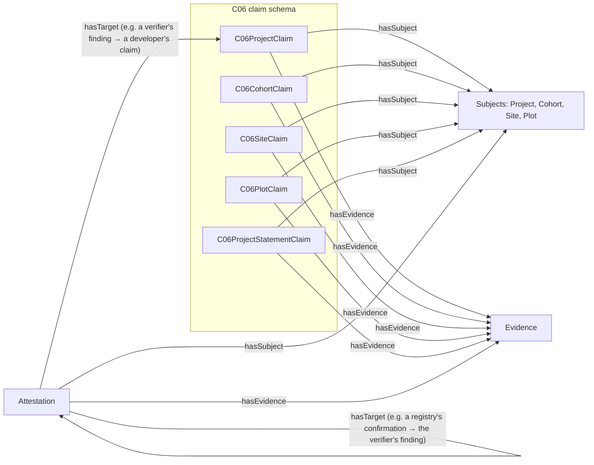
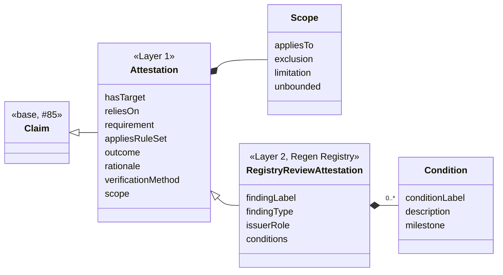

# Attestation, Evidence and the C06 claims

This document describes the schemas added for
[#73 (WP1-06)](https://github.com/regen-network/regen-data-standards/issues/73): the base
[`Attestation`](../schema/src/Attestation.yaml), the Regen Registry review vocabulary
[`RegistryReviewAttestation`](../schema/src/RegistryReviewAttestation.yaml), the full
[`Evidence`](../schema/src/Evidence.yaml), the shared terms added to
[`ClaimVocabulary`](../schema/src/ClaimVocabulary.yaml), and the C06 claim schema
[`C06Claim`](../schema/src/C06Claim.yaml). It builds on the base Claim described in
[`docs/claim-base.md`](claim-base.md).

The design was derived from the records of one real registration and validation review, the WP8-01
workflow ([claims#49](https://github.com/regen-network/claims/issues/49)). That evidence is project
data and is kept internally; this document and the examples use synthetic values only.

## How the types relate



| Type | Produced by | Consumed by | Reuse decision |
|---|---|---|---|
| C06 claims | The project developer, as claimant, from its project plan and datasets | Registry review, rule evaluation (WP5), the verifier, auditors, graph queries (WP4), publication (WP7) | New `C06Claim` schema; classes `is_a Claim` |
| C06 subjects | Defined once in the C06 claim schema; IRIs built from the keys the project's records use | Every claim and attestation about them | `is_a ClaimSubject` |
| `Attestation` | Any issuer of a judgment | Review workflows (WP5), verifiers, auditors, Ledger attestation (WP6-01), external mappings (WP7) | `Attestation.yaml` rewritten: `is_a Claim`, program-agnostic |
| `RegistryReviewAttestation` | The Registry Agent, an independent verifier (VVB), the Credit Class Admin | The same | New module; `is_a Attestation` |
| `Evidence` | Whoever cites a source | Reviewers, the resolver (WP6-04), auditors | The #85 skeleton, extended; no subclasses |

A project developer's response to a finding is a Claim by the developer (usually a revised C06
claim with new evidence), not an attestation.

`hasTarget` names what an attestation judges or answers: an exact, immutable version of a claim, of
another attestation, or of a snapshot (a fixed set of claim versions, identified by its SnapshotIRI,
[claims#56](https://github.com/regen-network/claims/issues/56)). A snapshot is the target when a
judgment covers a whole submission, such as a registration determination. `hasTarget` never names a
logical label: a finding that runs over several review rounds is a series of dated attestations,
grouped by the issuer's `findingLabel`.

## Modules

| Module | Change | Imports |
|---|---|---|
| `Claim.yaml` | `hasClaimType` removed (see [Field migrations](#field-migrations)). | as before |
| `ClaimVocabulary.yaml` | Adds `hasTarget`, `reliesOn`, `requirement`, `appliesRuleSet`, `verificationMethod`, `verificationMethodDescriptor` and the `VerificationMethodType` enum. | as before |
| `Evidence.yaml` | Adds the source hash, resolver, DCMI type, format, locator, licence reference and issue date, and the integrity-outcome terms. | as before |
| `Attestation.yaml` | Rewritten: `Attestation is_a Claim`, and `Scope`. | `Claim`, `ClaimVocabulary` |
| `RegistryReviewAttestation.yaml` | New: `RegistryReviewAttestation is_a Attestation`, `Condition`, and the review enums. | `Attestation` |
| `C06Claim.yaml` | New, version 0.1.0: four subject classes, five claim classes. | `Claim`, `ClaimSubject`, `ClaimVocabulary`, `taxonomy` |

No `Requirement` class exists or is added: requirements belong to the rule set (WP5), and claims and
attestations reference them by IRI. Inheritance follows #85: domain claims are `is_a Claim`, shared
terms are imported from `ClaimVocabulary`.

## Attestation

An attestation is an issuer's dated, scoped judgment. It is a Claim: attributed (`hasClaimant` is the
issuer), timed (`assertedAt`), about a subject, citing evidence, immutable, and revisable with
`wasRevisionOf`. It is about a subject (a project, a plot) even when it judges a claim about that
subject, because some judgments, such as a determination that a project meets a requirement, have no
single target claim.

It comes in two layers, following the story map's split between the claim substrate shared by every
program and one program's logic:



There is no attestation type field. Like `hasClaimType`, a single list of kinds of judgment would not
fit every program; the program's subclass and its outcome vocabulary say what a judgment is.

### `Attestation`

| Field | RDF term | Range | Card. | Meaning |
|---|---|---|---|---|
| `hasTarget` | `rfs:hasTarget` | IRI | 0..*, set | Exact versions judged or answered. |
| `reliesOn` | `rfs:reliesOn` ⊑ `dcterms:references` | IRI | 0..*, set | Versions the judgment depends on without judging them, such as a claim stating an enrolment cutoff. |
| `requirement` | `rfs:requirement` | IRI | 0..*, set | Requirements judged, each named within a checklist version. |
| `appliesRuleSet` | `rfs:appliesRuleSet` | IRI | 0..*, set | Exact rule-set versions applied (PG-1). |
| `outcome` | `rfs:outcome` | IRI | 0..1 | The verdict, a term from the program's vocabulary. |
| `rationale` | `rfs:rationale` | string | 0..1 | Why. |
| `verificationMethod` | `rfs:verificationMethod` | `VerificationMethodType` | 1 | How the issuer checked (CS-4). |
| `verificationMethodDescriptor` | `rfs:verificationMethodDescriptor` | string | 0..1 | Required with `OTHER` ([example](../schema/examples/attestation.INVALID-other-method-without-descriptor.yaml)). |
| `scope` | `rfs:scope` | `Scope` (inlined) | 0..1 | Where the judgment applies. |

**Scope.** `appliesTo` (subject IRIs), `exclusion` (what it explicitly does not cover), `limitation`
(what the judgment is not, for example "confirms the project structure; does not validate its
evidence") and `unbounded` (an explicit choice to give no limits). A scope is a blank node inside the
attestation and part of its content. Checking whether a subject is covered is a query; for the
[example](../schema/examples/registry-review-attestation.jsonld):

```sparql
ASK { ?attestation rfs:scope/rfs:appliesTo <https://example.org/c06/cohort/P-001-2024> }
```

returns false, so a 2024 cohort is out of scope, and the attestation's `reliesOn` names the
enrolment-cutoff claim the approval depends on.

### `RegistryReviewAttestation`

| Field | Range | Meaning |
|---|---|---|
| `findingLabel` | string | The issuer's identifier for a finding, stable across rounds, such as "CL 07(1)". |
| `findingType` | `CAR`, `CL`, `FAR`, `REGISTRY_ISSUE`, `OTHER` | Set when the attestation raises a finding. |
| `issuerRole` | `REGISTRY_AGENT`, `VVB`, `CREDIT_CLASS_ADMIN`, `OTHER` | Required. Lets a consumer check the issuer's authority. |
| `conditions` | list of `Condition` (`conditionLabel`, `description`, `milestone`) | Obligations carried to registration, pre-issuance, verification or all future verifications. |

`outcome` values are the IRIs of the `RegistryReviewOutcome` terms: the four registration
determinations (`rfs:ApprovedForRegistration`, `rfs:NotApproved`, `rfs:RequirementPending`,
`rfs:NotApplicable`) and the finding states (`rfs:FindingOpen`, `rfs:FindingClosed`), each stated as of
the attestation's date.

## Evidence

Evidence names one exact version of a source, says where to fetch it, lets a reader check the bytes,
and states the usage terms that applied to that version.

| Field | RDF term | Range | Card. | Meaning |
|---|---|---|---|---|
| `id` | — | IRI | 1 | The exact version cited, optionally with a fragment for a position. |
| `name`, `description` | `schema:name`, `schema:description` | string | 0..1 | Title; what it is, in the citer's words. |
| `sourceType` | `dcterms:type` | DCMI Type Vocabulary | 1 | `TEXT`, `DATASET`, `STILL_IMAGE`… Finer kinds a program accepts belong to its rule set. |
| `mediaType` | `dcterms:format` | string | 0..1 | For example `application/pdf`. |
| `contentHash` | `rfs:contentHash` | `ContentDigest` (algorithm, hex digest) | 1 | Hash of the bytes of the whole cited version. |
| `resolver` | `rfs:resolver` | URI | 1..*, set | Where the bytes can be fetched; the data can stay at its source (CS-3). |
| `locator` | `rfs:locator` | string | 0..1 | Position inside the source when the fragment is not enough. |
| `licence` | `dcterms:license` | URI | 0..1 | The licence document or versioned terms in effect. |
| `issued` | `dcterms:issued` | date | 0..1 | Date of the cited version. |

**Licence terms.** `licence` references the terms in effect by IRI: a standard licence document, or a
versioned terms document whose IRI changes when the terms change, so a citation keeps the version it was
made under. When `licence` is absent, the terms are `unspecified — all rights reserved`
(`rfs:UnspecifiedAllRightsReserved`), never unrestricted. Terms as structured fields (permitted uses,
prohibitions, attribution, fees, effective dates) belong to story EX-2, which the Work Packages place in
Layer 3, to be tested with data owners before any implementation; the WP8-01 records state no licence
terms to model. When EX-2 is taken up, the W3C ODRL model (permissions, prohibitions, duties) is the
first candidate to reuse.

**Integrity and access outcomes** (`EvidenceCheckOutcome`: `EVIDENCE_INTACT`, `EVIDENCE_ALTERED`,
`UNREACHABLE`, `ACCESS_RESTRICTED`) are terms the resolver reports when a consumer fetches evidence.
They are not stored in claims: current availability, access and the currently offered licence change
after the citation.

**Evidence IRI.** Still open, to decide with WP6-04 and
[claims#1](https://github.com/regen-network/claims/issues/1): the source's own versioned identifier, an
IRI derived from its hash, or a storage IRI that includes a revision. An editable source, such as a
spreadsheet or database, is cited through a captured export and its hash.

## Shared terms

**Verification method** (CS-4): `SELF_ATTESTED`, `PEER_OR_COMMUNITY`, `LAB_MEASURED`,
`SENSOR_DERIVED`, `MODEL_ESTIMATED`, `THIRD_PARTY_AUDITED`, `OTHER` with
`verificationMethodDescriptor`. Required on attestations, one per attestation: its party and date are
the issuer and `assertedAt`, so a subject checked by two methods has two attestations, each with its own
party and date (CS-4). A claim with no attestation is self-attested by the base Claim's definition. The
extension path is `OTHER` with a descriptor, then a new value in a later schema version.

**Rule-set version** (`appliesRuleSet`, PG-1) and **requirement** (`requirement`) references are IRIs
of exact versions. A requirement IRI names its checklist version, because the same short ID can name
different requirements in different versions; mapping historical IDs to current ones is rule-set data.
Neither is a schema-version declaration.

## C06 claims

A C06 claim class adds fields only where a registration requirement needs a specific value to be
checked (a date, a period, an identifier, an area, a category). Requirements that only need the
project plan to contain a statement use `C06ProjectStatementClaim`: the developer's words in
`description` and the plan section as evidence. Which requirement a statement answers is recorded by
the reviewer's attestation.

Subjects hold what identifies a thing and places it in the project; values that reviewers judge are
on the claims, because a later plan version or another party can assert them differently.

| Subject | Fields |
|---|---|
| `Project` | `registryProjectId` |
| `Cohort` (the sites whose baseline sampling took place in one year) | `baselineYear`, `project` |
| `Site` | `siteKey`, `country`, `project`, `cohort` |
| `Plot` | `plotKey`, `parcelId`, `site` |

| Claim | Fields |
|---|---|
| `C06ProjectClaim` | `appliesRuleSet`, `methodologyUse`, `isAggregateProject`, `aggregationBasis`, `ecosystemTypes`, `mandatoryPractices`, `complementaryPractices`, `aggregateStartDate`, `startDateBasis`, `adoptionDate`, `creditingPeriod`, `permanencePeriod`, `enrolmentCutoff`, `area`, `requestedDeviations` |
| `C06CohortClaim` | `creditingPeriod`, `finalMonitoringYear`, `permanencePeriod`, `area` |
| `C06SiteClaim` | `siteProjectStartDate`, `startDateBasis`, `creditingPeriod`, `ecosystemTypes`, `climateClass`, `soilGroup`, `practices`, `historicActivityYears`, `primaryLandUse`, `monitoringSampleDates`, `monitoringIntervalJustification` |
| `C06PlotClaim` | `area`, `geometry`, `primaryLandUse`, `eligible`, `eligibilityBasis`, `tenureBasis`, `tenureRecord`, `landUseChangeScreening`, `enrolmentStatus`, `enrolmentStatusReason` |
| `C06ProjectStatementClaim` | none beyond the base Claim |

Ecosystem types and practices reuse the taxonomy's `EnvironmentType` and `ActivityType`.

**Derived values.** No derivation reference is needed. When a value is derived from other records,
such as a site start date taken from the first soil sampling, the claimant states the value and its
basis (`startDateBasis`), and a reviewer who derives a value states it in an attestation.

## Examples

All examples are synthetic and generated from the playground fixtures by `make -C schema
gen-claim-examples`; `make -C schema check-claim-examples` validates each with both generated
validators.

| Example | Shows |
|---|---|
| [`c06-mvp-claim.jsonld`](../schema/examples/c06-mvp-claim.jsonld) | A `C06SiteClaim`: base Claim fields, a `Site` subject with its identifying fields, C06 values, evidence as a document and a dataset |
| [`c06-project-claim.jsonld`](../schema/examples/c06-project-claim.jsonld) | A `C06ProjectClaim` with exact rule-set and methodology versions, periods, an enrolment cutoff, a requested deviation, and evidence under a versioned licence |
| [`c06-cohort-claim.jsonld`](../schema/examples/c06-cohort-claim.jsonld) | A `C06CohortClaim` |
| [`c06-plot-claim.jsonld`](../schema/examples/c06-plot-claim.jsonld) | A `C06PlotClaim` with tenure, land-use-change screening and a GeoPackage feature |
| [`c06-project-statement-claim.jsonld`](../schema/examples/c06-project-statement-claim.jsonld) | A `C06ProjectStatementClaim` |
| [`generic-attestation.jsonld`](../schema/examples/generic-attestation.jsonld) | A base `Attestation` with no program vocabulary, and a verification method outside the enumeration (`OTHER` with a descriptor) |
| [`registry-review-attestation.jsonld`](../schema/examples/registry-review-attestation.jsonld) | A `RegistryReviewAttestation`: a confirmation with targets, a relied-on claim, a rule-set version, a scope and a condition |
| `*.INVALID-*.yaml` | Documents each validator must reject. The two that break a LinkML rule are marked `# shacl: not enforced`: JSON Schema rejects them, SHACL does not express rules |

## Validation entry points

#73 asks for the validation entry point and target nodes, inherited constraints, extension-field
handling, and that imported definitions are not separate whole-claim targets. As in
[`docs/claim-base.md`](claim-base.md):

1. The validator starts from the class the root node declares (`C06SiteClaim`, `Attestation`,
   `RegistryReviewAttestation`…); each has one shape.
2. That shape includes the base Claim's constraints, through `is_a`. C06 classes narrow
   `hasSubject` to their subject class.
3. Nested nodes (subjects, evidence, scope, conditions) are checked as values of the root, not as
   documents of their own.
4. Shapes are closed: fields the schema does not define are rejected
   ([example](../schema/examples/c06-claim.INVALID-undeclared-field.yaml)).
5. The root is typed with its own class only, not also `Claim`.

The service's responses to failing documents are
[claims#55](https://github.com/regen-network/claims/issues/55) and
[claims#18](https://github.com/regen-network/claims/issues/18).

## Exclusions

The rule comes from ADR 0001 D1 ([#56](https://github.com/regen-network/regen-data-standards/pull/56)),
cited in [#70](https://github.com/regen-network/regen-data-standards/issues/70) as PR #55's content
exclusions, and applied to the base Claim by [#85](https://github.com/regen-network/regen-data-standards/pull/85):
a record identified by a hash of its own content cannot contain that hash, nor state that changes after
it is made.

| Excluded | Where it lives instead |
|---|---|
| An attestation's own hash or IRI (`contentHash`, `graphIri`, added by [#53](https://github.com/regen-network/regen-data-standards/pull/53)) | Computed by the service ([claims#1](https://github.com/regen-network/claims/issues/1)); anchoring state in WP6 ([example](../schema/examples/attestation.INVALID-own-content-hash.yaml)) |
| `PENDING` as a placeholder verdict (#53: "no verdict has been rendered yet") | Not recorded: an attestation is made when there is a judgment. A dated determination that a requirement cannot yet be decided is `rfs:RequirementPending`. |
| A finding's current status as an updated field | Each dated attestation states the status as of its date; the current status is computed |
| Whether a version is controlling, superseded or stale; whether a confirmation is awaited | Computed by the services |
| Current availability, access and licence of evidence | Reported by the resolver |

The hash of a *cited source* (`Evidence.contentHash`) is not excluded: it is what lets a reader verify
the source.

## Field migrations

| Was | Now |
|---|---|
| `Claim.hasClaimType` (required) | Removed: a single required enum could not cover every kind of claim ([#86](https://github.com/regen-network/regen-data-standards/issues/86)). The kind of claim is the specialized class. |
| `Attestation.attestsClaim` (string) | `hasTarget` (IRI, 0..*) |
| `Attestation.hasReviewer` (Entity) | `hasClaimant` (inherited); the capacity is `RegistryReviewAttestation.issuerRole` |
| `Attestation.hasVerdict` (`VerdictType`) | `outcome` (IRI). `PENDING` dropped; the other values map to `RegistryReviewOutcome` terms. `VerdictType` remains in the taxonomy. |
| `Attestation.rationale` | Unchanged |
| `Attestation.evidenceReviewed` (bare URI) | `hasEvidence` (Evidence nodes, inherited) |
| `Attestation.attestationDate` (date) | `assertedAt` (UTC datetime, inherited) |
| `Attestation.contentHash`, `graphIri` | Removed |
| `Evidence` (IRI, name, description) | Adds required `sourceType`, `contentHash` and `resolver`: existing evidence must state them |

## Known limitations

- **Outcome values are not checked against the review vocabulary.** LinkML 1.11 cannot narrow an
  IRI-valued slot to an enum in a subclass (the generated Python model of the base class rejects the
  enum value), so `RegistryReviewAttestation.outcome` accepts any IRI. The vocabulary is documented by
  the `RegistryReviewOutcome` enum.
- **Two rules are enforced by JSON Schema only:** a descriptor with `OTHER` (CS-4), and at least one
  piece of evidence on a finding (CS-3). They are LinkML rules, which the generated SHACL does not
  express. **Not enforced:** a scope that has neither `appliesTo` nor `unbounded: true` (AD-1): the
  generated JSON Schema compares the boolean with a string.
- **Subject references are plain IRIs** (`appliesTo`, `project`, `cohort`, `site`), not typed nodes:
  a typed node of a `ClaimSubject` subclass would fail the generated `sh:class` check unless the
  validator is given the class hierarchy.
- **Areas are QUDT quantity values** (`area`: `qudt:numericValue` and `qudt:unit`, with hectares, `unit:HA`, as the only unit), defined in `C06Claim.yaml`. `ProjectInfo.yaml` has its own `QuantityValue` whose `unit` is a string, so its fixtures' `unit:HA` is a literal, not the QUDT unit IRI; a shared quantity structure is open (#86).
- **Not modelled yet:** the activity that produced a piece of evidence (`prov:wasGeneratedBy`), and the
  domain activity with its operator (`wasAssociatedWith`).
- **Granularity** (one claim per plot, or site claims carrying plot records) and whether dataset rows
  are claims or evidence are open.
