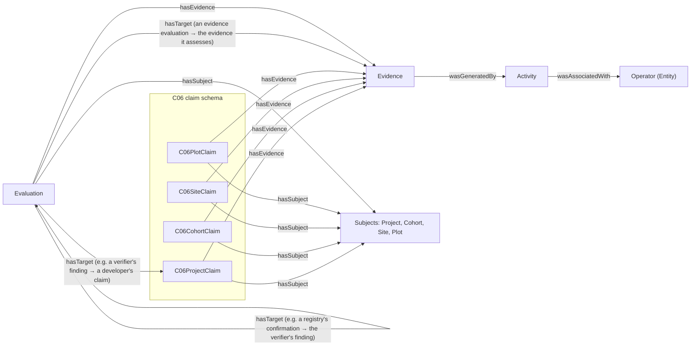
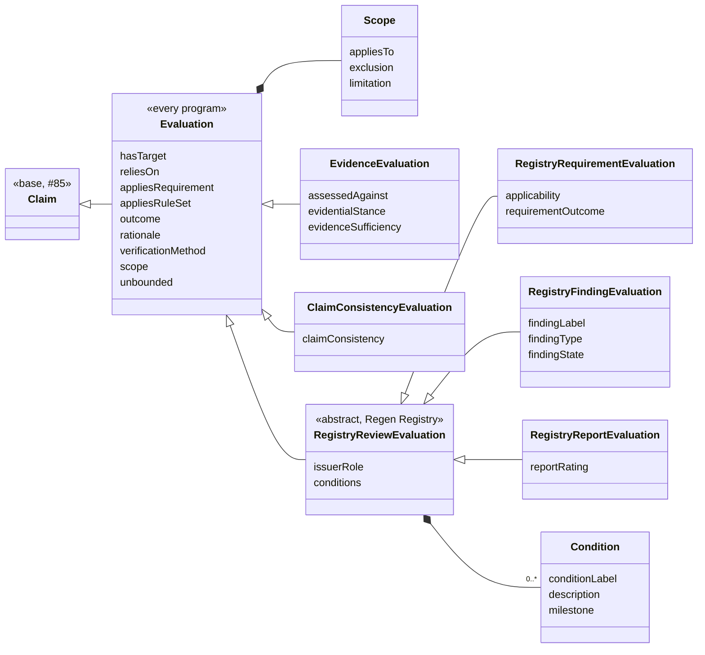

# Evaluation, Evidence and the C06 claims

This document describes the schemas added for
[#73 (WP1-06)](https://github.com/regen-network/regen-data-standards/issues/73): the base
[`Evaluation`](../schema/src/Evaluation.yaml) with its program-agnostic kinds, the Regen Registry
review kinds in [`RegistryReviewEvaluation`](../schema/src/RegistryReviewEvaluation.yaml), the full
[`Evidence`](../schema/src/Evidence.yaml) with the [`Activity`](../schema/src/Activity.yaml) that
generated it, the shared terms added to
[`ClaimVocabulary`](../schema/src/ClaimVocabulary.yaml), and the C06 claim schema
[`C06Claim`](../schema/src/C06Claim.yaml). It builds on the base Claim described in
[`docs/claim-base.md`](claim-base.md).

The design was derived from the records of one real registration and validation review, the WP8-01
workflow ([claims#49](https://github.com/regen-network/claims/issues/49)). That evidence is project
data and is kept internally; this document and the examples use synthetic values only.

## How the types relate



| Type | Produced by | Consumed by | Reuse decision |
|---|---|---|---|
| C06 claims | The project developer, as claimant, from its project plan and datasets | Registry review, rule evaluation (WP5), the verifier, auditors, graph queries (WP4), publication (WP7) | New `C06Claim` schema; classes `is_a Claim` |
| C06 subjects | Defined once in the C06 claim schema; IRIs built from the keys the project's records use | Every claim and evaluation about them | `is_a ClaimSubject` |
| `Evaluation`, `EvidenceEvaluation`, `ClaimConsistencyEvaluation` | Any issuer of a judgment | Review workflows (WP5), verifiers, auditors, Ledger attestation (WP6-01), external mappings (WP7) | `Attestation.yaml` rewritten: `is_a Claim`, program-agnostic |
| `RegistryRequirementEvaluation`, `RegistryFindingEvaluation`, `RegistryReportEvaluation` | The Registry Agent, an independent verifier (VVB), the Credit Class Admin | The same | New module; `is_a RegistryReviewEvaluation` (abstract) `is_a Evaluation` |
| `Evidence` | Whoever cites a source | Reviewers, the resolver (WP6-04), auditors | The #85 skeleton, extended; no subclasses |
| `Activity` | Whoever cites the evidence it generated | Reviewers checking when and by whom evidence was produced | New module; `ProvActivity` mixin |

A project developer's response to a finding is a Claim by the developer (usually a revised C06
claim with new evidence), not an evaluation.

`hasTarget` names what an evaluation judges or answers: an exact, immutable version of a claim, of
another evaluation, or of a snapshot (a fixed set of claim versions, identified by its SnapshotIRI,
[claims#56](https://github.com/regen-network/claims/issues/56)). A snapshot is the target when a
judgment covers a whole submission, such as a verifier's report rating. An evidence evaluation
targets `Evidence` records instead (see [`EvidenceEvaluation`](#evidenceevaluation)). `hasTarget` never names a
logical label: a finding that runs over several review rounds is a series of dated evaluations,
grouped by the issuer's `findingLabel`.

## Modules

| Module | Change | Imports |
|---|---|---|
| `Claim.yaml` | `hasClaimType` removed (see [Field migrations](#field-migrations)). | as before |
| `ClaimVocabulary.yaml` | Adds `hasTarget`, `reliesOn`, `appliesRequirement`, `addressesRequirement`, `appliesRuleSet`, `verificationMethod`, `verificationMethodDescriptor` and the `VerificationMethodType` enum. `wasAssociatedWith` moves to `Activity.yaml`, which it imports, so importing `ClaimVocabulary` still provides it. | adds `Activity` |
| `Evidence.yaml` | Adds the source hash, resolver, DCMI type, format, locator, licence reference, issue date and generating activity (`wasGeneratedBy`), and the integrity-outcome terms. | adds `Activity` |
| `Activity.yaml` | New: `Activity` (IRI, `name`, `description`, `startDate`, `endDate`, `wasAssociatedWith`). `startDate` and `endDate` move here from `C06Claim.yaml`. It is a separate module because `Evidence` needs it and `ClaimVocabulary` imports `Evidence`. | `Entity`, `ProvAlignment` |
| `Evaluation.yaml` | Replaces `Attestation.yaml`: `Evaluation is_a Claim`, `Scope`, and the program-agnostic kinds `EvidenceEvaluation` and `ClaimConsistencyEvaluation` with their verdict enums. | `Claim`, `ClaimVocabulary` |
| `RegistryReviewEvaluation.yaml` | New: the abstract `RegistryReviewEvaluation is_a Evaluation`, its kinds `RegistryRequirementEvaluation`, `RegistryFindingEvaluation` and `RegistryReportEvaluation`, `Condition`, and the review enums. | `Evaluation` |
| `C06Claim.yaml` | New, version 0.1.0: four subject classes, five claim classes. | `Claim`, `ClaimSubject`, `ClaimVocabulary`, `taxonomy` |

No `Requirement` class exists or is added: requirements belong to the rule set, whose format WP5-01
([claims#30](https://github.com/regen-network/claims/issues/30)) defines, and claims and evaluations
reference them by IRI. Inheritance follows #85: domain claims are `is_a Claim`, shared
terms are imported from `ClaimVocabulary`.

## Evaluation

An evaluation is an issuer's dated, scoped judgment. It is a Claim: attributed (`assertedBy` is the
issuer), timed (`assertedAt`), about a subject, citing evidence, immutable, and revisable with
`wasRevisionOf`. It is about a subject (a project, a plot) even when it judges a claim about that
subject, because some judgments, such as a determination that a project meets a requirement, have no
single target claim.

It is called an evaluation, not an attestation, because it records the judgment itself. Attestation
is left for an agent binding itself to exact content, which the data module's `MsgAttest` does on
Regen Ledger: an attestor signs a record's Graph IRI. Any Claim or Evaluation can be attested that
way; what to attest and who signs is [WP6-01 (claims#36)](https://github.com/regen-network/claims/issues/36).

It comes in two layers: what every program's judgments share, with the kinds of judgment that are
not specific to a program, and one program's review kinds:



There is no evaluation type field. Like `hasClaimType`, a single list of kinds of judgment would not
fit every program. Each kind of judgment is a subclass with its own verdict field and allowed values,
because the kinds answer different questions: whether a requirement is satisfied, whether a finding
is open, how a verifier rates its report, what evidence shows. Each verdict field is a sub-property
of the generic `outcome` with an enumerated range, so both generated validators check its values (an
enum in JSON Schema, `sh:in` in SHACL), and the OWL output declares `rdfs:subPropertyOf rfs:outcome`,
so a query for `outcome` still finds every verdict when the class hierarchy is loaded.

An evaluation records a judgment. It is neither workflow state (a review that has not started or is
in progress is recorded with no evaluation) nor an institutional decision, such as approving a
project's registration, which evaluations inform. That decision is not modelled here; it is left for
WP5.

### `Evaluation`

| Field | RDF term | Range | Card. | Meaning |
|---|---|---|---|---|
| `hasTarget` | `rfs:hasTarget` | IRI | 0..*, set | Exact versions judged or answered. |
| `reliesOn` | `rfs:reliesOn` ⊑ `dcterms:references` | IRI | 0..*, set | Versions the judgment depends on without judging them, such as a claim stating an enrolment cutoff. |
| `appliesRequirement` | `rfs:appliesRequirement` | IRI | 0..*, set | Exact requirement versions the evaluation applies or judges, whether or not the claimant named them. |
| `appliesRuleSet` | `rfs:appliesRuleSet` | IRI | 0..*, set | Exact rule-set versions applied. |
| `outcome` | `rfs:outcome` | IRI | 0..1 | The verdict, a term from the program's vocabulary, for an evaluation with no kind of its own. Kinds use a sub-property with an enum instead. |
| `rationale` | `rfs:rationale` | string | 0..1 | Why. |
| `verificationMethod` | `rfs:verificationMethod` | `VerificationMethodType` | 1 | How the issuer checked. |
| `verificationMethodDescriptor` | `rfs:verificationMethodDescriptor` | string | 0..1 | Required with `OTHER` ([example](../schema/examples/evaluation.INVALID-other-method-without-descriptor.yaml)). |
| `scope` | `rfs:scope` | `Scope` (inlined) | 0..1 | Where the judgment applies. |
| `unbounded` | `rfs:unbounded` | boolean | 0..1 | True when the issuer explicitly gives the judgment no limits beyond its targets. Exclusive with `scope`. |

**Scope.** `appliesTo` (subject IRIs, required: a scope always names the subjects it covers),
`exclusion` (what it explicitly does not cover) and `limitation` (what the judgment is not, for example
"confirms the project structure; does not validate its evidence"). An evaluation without a scope
applies only to what it targets; `unbounded: true` states explicitly that it has no limits, so an
unlimited approval is never an omission
([example](../schema/examples/evaluation.INVALID-scope-without-subjects.yaml) of an empty scope being
rejected). The two are exclusive: an evaluation with a scope does not state `unbounded`, so a consumer
never has to choose between them ([example](../schema/examples/evaluation.INVALID-scope-and-unbounded.yaml),
rejected by JSON Schema only; see [Known limitations](#known-limitations)). A scope is a blank node inside the evaluation and part of its content. Checking whether a subject is covered is a query; for the
[example](../schema/examples/registry-requirement-evaluation.jsonld):

```sparql
ASK { ?evaluation rfs:scope/rfs:appliesTo <https://example.org/c06/cohort/P-001-2024> }
```

returns false, so a 2024 cohort is out of scope, and the evaluation's `reliesOn` names the
enrolment-cutoff claim the confirmation depends on.

### `EvidenceEvaluation`

What an identified body of evidence shows about one claim or requirement. Stance and sufficiency are
relative to that claim or requirement, and apply to the targeted evidence as a whole, not to each item
in isolation.

| Field | RDF term | Range | Card. | Meaning |
|---|---|---|---|---|
| `hasTarget` | `rfs:hasTarget` | IRI | 1..*, set | The `Evidence` records assessed, as one body of evidence. |
| `assessedAgainst` | `rfs:assessedAgainst` | IRI | 1 | The exact claim or requirement version the stance and sufficiency are relative to. A requirement is an IRI, as in `appliesRequirement` (see [Shared terms](#shared-terms)); neither validator checks what the IRI identifies ([example](../schema/examples/evidence-evaluation.INVALID-without-assessed-against.yaml) without it). |
| `evidentialStance` | `rfs:evidentialStance` ⊑ `rfs:outcome` | `SUPPORTS`, `CHALLENGES`, `NO_BEARING` | 1 | Whether the evidence supports or challenges it, or has no bearing on it. |
| `evidenceSufficiency` | `rfs:evidenceSufficiency` ⊑ `rfs:outcome` | `SUFFICIENT`, `INSUFFICIENT` | 0..1 | Whether the evidence is enough to establish its stance: sufficient challenging evidence contradicts the claim. Absent with `NO_BEARING` ([example](../schema/examples/evidence-evaluation.INVALID-no-bearing-with-sufficiency.yaml), JSON Schema only). |

### `ClaimConsistencyEvaluation`

Whether a claim's `claimStatement` and its structured fields express the same assertion. The
generated validators cannot compare prose with values, so a reviewer records the result on the exact
claim version (`hasTarget`, required). `claimConsistency` (⊑ `rfs:outcome`) is `CONSISTENT` or
`INTERNALLY_INCONSISTENT`, and `rationale` is required: it says where they agree or disagree
([example](../schema/examples/claim-consistency-evaluation.INVALID-without-rationale.yaml) without
it). Neither the statement nor the fields override the other: an internally inconsistent claim is
corrected by a new version before its evidence is evaluated.

### Regen Registry review kinds

`RegistryReviewEvaluation` is abstract: every Registry review judgment is one of its three kinds,
each with its own required verdict. It holds what the kinds share:

| Field | Range | Meaning |
|---|---|---|
| `issuerRole` | `REGISTRY_AGENT`, `VVB`, `CREDIT_CLASS_ADMIN`, `OTHER` | Required. The capacity in which the issuer is recorded as acting; it does not by itself establish the issuer's authority. |
| `conditions` | list of `Condition` (`conditionLabel`, `description`, `milestone`) | Obligations carried to registration, pre-issuance, verification or all future verifications. |

**`RegistryRequirementEvaluation`**: the evaluator's finding, as of its date, on whether a project
meets the exact requirement versions it applies (`appliesRequirement`, required).

| Field | RDF term | Range | Card. | Meaning |
|---|---|---|---|---|
| `applicability` | `rfs:applicability` | `APPLICABLE`, `NOT_APPLICABLE` | 1 | Whether the requirement applies to the subject. |
| `requirementOutcome` | `rfs:requirementOutcome` ⊑ `rfs:outcome` | `SATISFIED`, `NOT_SATISFIED`, `UNDETERMINED` | 0..1 | Required when the requirement applies, absent when it does not ([example](../schema/examples/registry-requirement-evaluation.INVALID-applicable-without-outcome.yaml), [example](../schema/examples/registry-requirement-evaluation.INVALID-not-applicable-with-outcome.yaml), JSON Schema only). |

`UNDETERMINED` is a finding: the evaluator assessed the requirement and found that what is available
is not yet enough to decide either way, for example because records it needs are due later. The
rationale, required with `UNDETERMINED`, says what is missing
([example](../schema/examples/registry-requirement-evaluation.INVALID-undetermined-without-rationale.yaml),
JSON Schema only). A review still in progress is recorded with no evaluation.
`SATISFIED` is not an approval of the project's registration
([example](../schema/examples/registry-requirement-evaluation.INVALID-registration-approval.yaml) of
a registration approval as a requirement outcome being rejected).

**`RegistryFindingEvaluation`**: a corrective action, clarification or forward action request, or a
material issue raised by the Registry Agent, or a later assessment of one. Each record requires
`findingLabel` (the issuer's identifier, stable across rounds, such as "CL 07(1)"), `findingType`
(`CAR`, `CL`, `FAR`, `REGISTRY_ISSUE`, `OTHER`), `findingState` (⊑ `rfs:outcome`: `OPEN` or `CLOSED`
as of its date, [example](../schema/examples/registry-finding-evaluation.INVALID-without-state.yaml)
without it) and at least one piece of evidence
([example](../schema/examples/registry-finding-evaluation.INVALID-without-evidence.yaml) without
evidence). Later assessments target the earlier record and carry the same `findingLabel`; the current
state is derived from the latest one, not stored.

**`RegistryReportEvaluation`**: an independent verifier's rating of the project in its validation or
verification report, `reportRating` (⊑ `rfs:outcome`): `ACCEPTANCE`, `ACCEPTANCE_WITH_CONTINGENCIES`
or `REJECTION`, the ratings the Program Guide (sections 12.4 and 12.5) gives such a report. It is the
verifier's rating, not the Registry's decision. The generic `outcome` does not replace it
([example](../schema/examples/registry-report-evaluation.INVALID-generic-outcome.yaml)).

## Evidence

Evidence names one exact version of a source, says where to fetch it, lets a reader check the bytes,
and states the usage terms that applied to that version.

| Field | RDF term | Range | Card. | Meaning |
|---|---|---|---|---|
| `id` | — | IRI | 1 | The exact version cited, optionally with a fragment for a position. |
| `name`, `description` | `schema:name`, `schema:description` | string | 0..1 | Title; what it is, in the citer's words. |
| `sourceType` | `dcterms:type` | DCMI Type Vocabulary | 1 | `TEXT`, `DATASET`, `STILL_IMAGE`… Finer kinds a program accepts belong to its rule set. |
| `mediaType` | `dcterms:format` | string | 0..1 | For example `application/pdf`. |
| `contentHash` | `rfs:contentHash` | `ContentDigest` (algorithm, hex digest) | 1 | Hash of the bytes of the whole cited version. |
| `resolver` | `rfs:resolver` | URI | 1..*, set | Where the bytes can be fetched; the data can stay at its source. |
| `locator` | `rfs:locator` | string | 0..1 | Position inside the source when the fragment is not enough. |
| `licence` | `dcterms:license` | URI | 0..1 | The licence document or versioned terms in effect. |
| `issued` | `dcterms:issued` | date | 0..1 | Date of the cited version. |
| `wasGeneratedBy` | `prov:wasGeneratedBy` | `Activity` (inlined, with its IRI) | 0..1 | The activity that produced the source. |

**Who produced it, and when.** `wasGeneratedBy` names the activity that produced the cited source,
for example the soil sampling behind a results file, or the field operations a farm management
record documents. The activity has its own IRI, its period (`startDate`, `endDate`, as dates) and
who carried it out (`wasAssociatedWith`), who may differ from the claimant. The time a source was
produced is the activity's, not a field of Evidence, because PROV-O declares activities and entities
disjoint. Evidence produced by the same activity names the same activity IRI, so an activity always
has one ([example](../schema/examples/c06-claim.INVALID-activity-without-iri.yaml) of an activity
without an IRI being rejected). A claim reaches the
activity through its evidence (claim → `hasEvidence` → `wasGeneratedBy` → activity); it does not
describe the activity again. The C06 claims need no domain activity of their own: no C06 registration
requirement checks who carried out a practice, only which practices a site applies (`practices`) and
the records that support it.

**Licence terms.** `licence` references the terms in effect by IRI: a standard licence document, or a
versioned terms document whose IRI changes when the terms change, so a citation keeps the version it was
made under. When `licence` is absent, the terms are `unspecified — all rights reserved`
(`rfs:UnspecifiedAllRightsReserved`), never unrestricted. Terms as structured fields (permitted uses,
prohibitions, attribution, fees, effective dates) are left for later work, to be tested with data
owners before any implementation; the WP8-01 records state no licence terms to model. When they are
taken up, the W3C ODRL model (permissions, prohibitions, duties) is the
first candidate to reuse.

**Integrity and access outcomes** (`EvidenceCheckOutcome`: `EVIDENCE_INTACT`, `EVIDENCE_ALTERED`,
`UNREACHABLE`, `ACCESS_RESTRICTED`) are terms the resolver reports when a consumer fetches evidence.
They are not stored in claims: current availability, access and the currently offered licence change
after the citation.

**Evidence IRI.** Still open, to decide with WP6-04 and
[claims#1](https://github.com/regen-network/claims/issues/1): the source's own versioned identifier, an
IRI derived from its hash, or a storage IRI that includes a revision. An editable source, such as a
spreadsheet or database, is cited through a captured export and its hash.

## Shared terms

**Verification method:** `SELF_ATTESTED`, `PEER_OR_COMMUNITY`, `LAB_MEASURED`,
`SENSOR_DERIVED`, `MODEL_ESTIMATED`, `THIRD_PARTY_AUDITED`, `OTHER` with
`verificationMethodDescriptor`. Required on evaluations, one per evaluation: its party and date are
the issuer and `assertedAt`, so a subject checked by two methods has two evaluations, each with its own
party and date. A claim with no evaluation is self-attested by the base Claim's definition. The
extension path is `OTHER` with a descriptor, then a new value in a later schema version.

**Rule-set version** (`appliesRuleSet`) and **requirement** references are IRIs of exact versions.
A requirement IRI identifies one immutable requirement version within an exact rule-set version,
such as a checklist version, because the same short ID can name different requirements in different
versions; mapping historical IDs to current ones is rule-set data. Neither is a schema-version
declaration.

Two relations reference requirements, from the two sides:

- `appliesRequirement`, on an evaluation: the requirement versions it applies or judges, whether or
  not the claimant named them.
- `addressesRequirement`, where a claimant names a requirement: the requirement versions the claimant
  presents a Claim, or part of it, as responding to. It records intent only and implies neither that
  the requirement applies nor that it is met. It is not on the base Claim, since many claims respond
  to no requirement; a claim type selects it, as `DeviationRequest` does for the requirements a
  deviation replaces.

## C06 claims

A C06 claim class adds fields only where a registration requirement needs a specific value to be
checked (a date, a period, an identifier, an area, a category). A requirement that only needs the
project plan to contain a statement is answered by a `C06ProjectClaim` with no structured fields:
the developer's words in `claimStatement` and the plan section as evidence. Every Claim requires a
`claimStatement`, so no separate statement class is needed. Which requirement a statement answers is recorded by
the reviewer's evaluation.

Subjects hold what identifies a thing and places it in the project; values that reviewers judge are
on the claims, because a later plan version or another party can assert them differently.

| Subject | Fields |
|---|---|
| `Project` | `registryProjectId` |
| `Cohort` (the sites whose baseline sampling took place in one year) | `baselineYear`, `project` |
| `Site` | `siteKey`, `country`, `project`, `cohort` |
| `Plot` | `plotKey`, `parcelId`, `site` |

| Claim | Fields |
|---|---|
| `C06ProjectClaim` | `appliesRuleSet`, `methodologyUse`, `isAggregateProject`, `aggregateStartDate`, `startDateBasis`, `adoptionDate`, `creditingPeriod`, `permanencePeriod`, `requestedDeviations` |
| `C06CohortClaim` | `creditingPeriod`, `permanencePeriod` |
| `C06SiteClaim` | `siteProjectStartDate`, `startDateBasis`, `creditingPeriod`, `ecosystemTypes`, `climateClass`, `soilGroup`, `practices`, `primaryLandUse`, `monitoringSampleDates`, `monitoringIntervalJustification` |
| `C06PlotClaim` | `area`, `geometry`, `tenureBasis`, `convertedFromNaturalEcosystem` |

Ecosystem types and practices reuse the taxonomy's `EnvironmentType` and `ActivityType`.

**What is not a claim field.** A field holds a value the claimant states and a requirement checks.
The following are therefore not fields:

- *Rules:* which practices an enrolled site must or may apply is the project's enrolment rule, not
  a fact a reviewer checks. A requirement checks the practices each site applies (`practices`).
- *Reviewers' conclusions:* whether a plot is eligible is what an evaluation decides. The claimant
  delineates the land (`geometry`).
- *Values computed from other claims:* the project's or a cohort's total area is the sum of its
  plots, and the project's ecosystem types are those of its sites.
- *Evidence:* the land register record behind a tenure basis, the land cover datasets behind a
  land-use history, and the historic activity records of a site are cited as `Evidence`. The period
  those records cover is their generating activity's.
- *Statements:* the basis of the aggregation, and that no sites are enrolled after a cutoff date,
  are `C06ProjectClaim`s carrying only their `claimStatement`. An evaluation that depends on the cutoff names that claim in
  `reliesOn`.
- *Lifecycle:* whether a plot is still enrolled (see [Exclusions](#exclusions)).

**Derived values.** No derivation reference is needed. When a value is derived from other records,
such as a site start date taken from the first soil sampling, the claimant states the value and its
basis (`startDateBasis`), and a reviewer who derives a value states it in an evaluation.

## Examples

All examples are synthetic and generated from the playground fixtures by `make -C schema
gen-claim-examples`; `make -C schema check-claim-examples` validates each with both generated
validators.

| Example | Shows |
|---|---|
| [`c06-mvp-claim.jsonld`](../schema/examples/c06-mvp-claim.jsonld) | A `C06SiteClaim`: base Claim fields, a `Site` subject with its identifying fields, C06 values, evidence as a document and datasets, and field records with the activity that generated them and its operator |
| [`c06-project-claim.jsonld`](../schema/examples/c06-project-claim.jsonld) | A `C06ProjectClaim` with exact rule-set and methodology versions, periods, a requested deviation, and evidence under a versioned licence |
| [`c06-cohort-claim.jsonld`](../schema/examples/c06-cohort-claim.jsonld) | A `C06CohortClaim` |
| [`c06-plot-claim.jsonld`](../schema/examples/c06-plot-claim.jsonld) | A `C06PlotClaim` with a tenure basis, a land-use history and a GeoPackage feature, and the land register extract and land cover maps as evidence |
| [`c06-project-claim-statement.jsonld`](../schema/examples/c06-project-claim-statement.jsonld) | A `C06ProjectClaim` whose assertion is its statement alone |
| [`generic-evaluation.jsonld`](../schema/examples/generic-evaluation.jsonld) | A base `Evaluation` with no program vocabulary, and a verification method outside the enumeration (`OTHER` with a descriptor) |
| [`evidence-evaluation.jsonld`](../schema/examples/evidence-evaluation.jsonld) | An `EvidenceEvaluation`: two `Evidence` records that support a claim but are not enough to establish it |
| [`claim-consistency-evaluation.jsonld`](../schema/examples/claim-consistency-evaluation.jsonld) | A `ClaimConsistencyEvaluation` recording that a claim's statement and area field disagree |
| [`registry-requirement-evaluation.jsonld`](../schema/examples/registry-requirement-evaluation.jsonld) | A `RegistryRequirementEvaluation`: a confirmation that a requirement is satisfied, with targets, a relied-on claim, rule-set and requirement versions, a scope and a condition |
| [`registry-finding-evaluation.jsonld`](../schema/examples/registry-finding-evaluation.jsonld) | A `RegistryFindingEvaluation`: an open clarification request with its type, label, target and evidence |
| [`registry-report-evaluation.jsonld`](../schema/examples/registry-report-evaluation.jsonld) | A `RegistryReportEvaluation`: a verifier's acceptance with contingencies |
| `*.INVALID-*.yaml` | Documents each validator must reject. Those that break a LinkML rule are marked `# shacl: not enforced`: JSON Schema rejects them, the generated SHACL does not express rules (see [Known limitations](#known-limitations)) |

## Validation entry points

#73 asks for the validation entry point and target nodes, inherited constraints, extension-field
handling, and that imported definitions are not separate whole-claim targets. As in
[`docs/claim-base.md`](claim-base.md):

1. The validator starts from the class the root node declares (`C06SiteClaim`, `Evaluation`,
   `RegistryRequirementEvaluation`…); each has one shape. `RegistryReviewEvaluation` is abstract,
   like `Claim`, and is not an entry point: its shape is open and checks the fields the Registry
   kinds share. Neither generated validator rejects a document typed with an abstract class, so the
   service has to ([claims#55](https://github.com/regen-network/claims/issues/55)).
2. That shape includes the base Claim's constraints, through `is_a`. C06 classes narrow
   `hasSubject` to their subject class.
3. Nested nodes (subjects, evidence and its activities, scope, conditions) are checked as values of the root, not as
   documents of their own.
4. Shapes are closed: fields the schema does not define are rejected
   ([example](../schema/examples/c06-claim.INVALID-undeclared-field.yaml)).
5. The root is typed with its own class only, not also `Claim`.

The service's responses to failing documents are
[claims#55](https://github.com/regen-network/claims/issues/55) and
[claims#18](https://github.com/regen-network/claims/issues/18).

## Exclusions

The rule comes from ADR 0001 D1 ([#56](https://github.com/regen-network/regen-data-standards/pull/56)),
cited in [#70](https://github.com/regen-network/regen-data-standards/issues/70) as PR #55's content
exclusions, and applied to the base Claim by [#85](https://github.com/regen-network/regen-data-standards/pull/85):
a record identified by a hash of its own content cannot contain that hash, nor state that changes after
it is made.

| Excluded | Where it lives instead |
|---|---|
| An evaluation's own hash or IRI (`contentHash`, `graphIri`, added by [#53](https://github.com/regen-network/regen-data-standards/pull/53)) | Computed by the service ([claims#1](https://github.com/regen-network/claims/issues/1)); anchoring state in WP6 ([example](../schema/examples/evaluation.INVALID-own-content-hash.yaml)) |
| `PENDING` as a placeholder verdict (#53: "no verdict has been rendered yet") | Not recorded: an evaluation is made when there is a judgment. A dated finding that a requirement cannot yet be decided is `requirementOutcome: UNDETERMINED`. |
| A finding's current status as an updated field | Each dated evaluation states the status as of its date; the current status is computed |
| Whether a version is controlling, superseded or stale; whether a confirmation is awaited | Computed by the services |
| Current availability, access and licence of evidence | Reported by the resolver |
| Whether a plot is still enrolled | Not a field: a cancelled plot is one the developer no longer claims in a later plan version |

The hash of a *cited source* (`Evidence.contentHash`) is not excluded: it is what lets a reader verify
the source.

## Field migrations

| Was | Now |
|---|---|
| `Attestation` (class), `Attestation.yaml` | `Evaluation`, `Evaluation.yaml`: the class records a judgment; attestation is left for binding an agent to content on the ledger. `RegistryReviewAttestation` and `RegistryFindingAttestation` became `RegistryReviewEvaluation` and `RegistryFindingEvaluation`. |
| `Claim.hasClaimType` (required) | Removed: a single required enum could not cover every kind of claim ([#86](https://github.com/regen-network/regen-data-standards/issues/86)). The kind of claim is the specialized class. |
| `Attestation.attestsClaim` (string) | `hasTarget` (IRI, 0..*) |
| `Attestation.hasReviewer` (Entity) | `assertedBy` (inherited); the capacity is `RegistryReviewEvaluation.issuerRole` |
| `Attestation.hasVerdict` (`VerdictType`) | The verdict field of each kind (`requirementOutcome`, `findingState`, `reportRating`, `evidentialStance`, `evidenceSufficiency`, `claimConsistency`), or `outcome` (IRI) on a base `Evaluation`. `PENDING` dropped. `VerdictType` remains in the taxonomy. |
| `RegistryReviewOutcome` (one enum for every Registry verdict, on `outcome`) | Split by kind: `RequirementOutcome` (`ApprovedForRegistration` → `SATISFIED`, `NotApproved` → `NOT_SATISFIED`, `RequirementPending` → `UNDETERMINED`), `Applicability` (`NotApplicable` → `NOT_APPLICABLE`), `FindingState`, `ReportRating`. A registration approval is an institutional decision, not a requirement outcome. |
| `Attestation.rationale` | Unchanged |
| `Attestation.evidenceReviewed` (bare URI) | `hasEvidence` (Evidence nodes, inherited) |
| `Attestation.attestationDate` (date) | `assertedAt` (UTC datetime, inherited) |
| `Attestation.contentHash`, `graphIri` | Removed |
| `Evidence` (IRI, name, description) | Adds required `sourceType`, `contentHash` and `resolver`: existing evidence must state them |

## Known limitations

- **The generic `outcome` accepts any IRI**, also on the kinds that have their own verdict field.
  The kinds' verdict fields are checked by both validators.
- **Six rules are enforced by JSON Schema only:** a descriptor with `OTHER` (the verification method
  is never empty); a scope and `unbounded` being exclusive; a requirement outcome when the requirement
  applies, and none when it does not; a rationale with `UNDETERMINED`; no sufficiency for evidence
  with no bearing. They are LinkML
  rules, and LinkML's SHACL generator does not translate rules: 1.11.1 ignores them, and the
  unreleased support ([linkml/linkml#3451](https://github.com/linkml/linkml/pull/3451)) covers other
  patterns ([linkml/linkml#2464](https://github.com/linkml/linkml/issues/2464)). SHACL itself can
  express them with `sh:or`. The other two conditional rules, evidence on a finding and a scope that
  names its subjects, are expressed as class and slot constraints, which both validators enforce.
- **Abstract classes are not rejected as entry points.** A document typed `RegistryReviewEvaluation`
  passes both generated validators (checked with LinkML 1.11.1), so a review judgment without its
  kind's verdict can only be caught by the service, as for a document typed `Claim`.
- **Subject references are plain IRIs** (`appliesTo`, `project`, `cohort`, `site`), not typed nodes:
  a typed node of a `ClaimSubject` subclass would fail the generated `sh:class` check unless the
  validator is given the class hierarchy.
- **Areas are QUDT quantity values** (`area`: the shared `QuantityValue` in `core.yaml`, also used
  by `ProjectInfo`'s `projectSize`). `numericValue` maps to `qudt:value` and `hasUnit` to
  `qudt:hasUnit`, the IRI of any QUDT unit, such as `unit:HA`. QUDT 2.1
  deprecated `qudt:unit` for `qudt:hasUnit`
  ([SCHEMA_QUDT-v2.1.ttl](https://github.com/qudt/qudt-public-repo/blob/4cfc2ec39b08d8ded5d1fe8451c4b3404ecea3ce/schema/SCHEMA_QUDT-v2.1.ttl#L3041-L3050))
  and 3.0.0 removed it
  ([CHANGELOG.md](https://github.com/qudt/qudt-public-repo/blob/9a2f71fcad04083372d56736c08741cb0e4fd251/CHANGELOG.md#L838)).
  The number and the unit are both required, and the number cannot be negative. The schema does
  not check that the unit is an area unit. A richer quantity structure, with uncertainty and rate
  denominators, is open
  ([#86](https://github.com/regen-network/regen-data-standards/issues/86)).
- **Operators have no IRI yet.** `wasAssociatedWith` names an `Entity`, which has no identifier until
  [#58](https://github.com/regen-network/regen-data-standards/pull/58), so the operator of an
  activity is a node with a name and type and cannot be joined across activities.
- **Granularity** (one claim per plot, or site claims carrying plot records) and whether dataset rows
  are claims or evidence are open.
