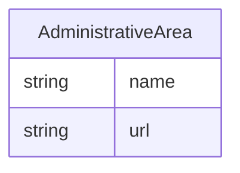

# Class: AdministrativeArea


URI: [schema:AdministrativeArea](http://schema.org/AdministrativeArea)





<!-- no inheritance hierarchy -->


## Slots

| Name | Cardinality and Range | Description | Inheritance |
| ---  | --- | --- | --- |
| [name](name.md) | 1 <br/> [String](String.md) | Name of the project | direct |
| [url](url.md) | 0..1 <br/> [String](String.md) |  | direct |


## Usages

| used by | used in | type | used |
| ---  | --- | --- | --- |
| [Project](Project.md) | [administrativeArea](administrativeArea.md) | range | [AdministrativeArea](AdministrativeArea.md) |


## Identifier and Mapping Information


### Schema Source


* from schema: https://framework.regen.network/schema/


## Mappings

| Mapping Type | Mapped Value |
| ---  | ---  |
| self | schema:AdministrativeArea |
| native | rfs:AdministrativeArea |


## LinkML Source

<!-- TODO: investigate https://stackoverflow.com/questions/37606292/how-to-create-tabbed-code-blocks-in-mkdocs-or-sphinx -->

### Direct

<details>
```yaml
name: AdministrativeArea
from_schema: https://framework.regen.network/schema/
slots:
- name
- url
class_uri: schema:AdministrativeArea

```
</details>

### Induced

<details>
```yaml
name: AdministrativeArea
from_schema: https://framework.regen.network/schema/
attributes:
  name:
    name: name
    description: Name of the project.
    from_schema: https://framework.regen.network/schema/
    rank: 1000
    slot_uri: schema:name
    alias: name
    owner: AdministrativeArea
    domain_of:
    - Project
    - ProjectRole
    - Organization
    - AdministrativeArea
    - File
    range: string
    required: true
  url:
    name: url
    from_schema: https://framework.regen.network/schema/
    rank: 1000
    alias: url
    owner: AdministrativeArea
    domain_of:
    - ProjectRole
    - Organization
    - AdministrativeArea
    range: string
class_uri: schema:AdministrativeArea

```
</details>