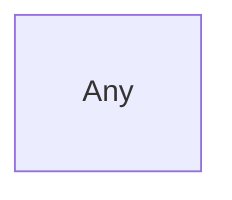

# Class: Any


URI: [linkml:Any](https://w3id.org/linkml/Any)





<!-- no inheritance hierarchy -->


## Slots

| Name | Cardinality and Range | Description | Inheritance |
| ---  | --- | --- | --- |


## Usages

| used by | used in | type | used |
| ---  | --- | --- | --- |
| [Location](Location.md) | [context](context.md) | range | [Any](Any.md) |
| [Location](Location.md) | [properties](properties.md) | range | [Any](Any.md) |


## Identifier and Mapping Information


### Schema Source


* from schema: https://framework.regen.network/schema/


## Mappings

| Mapping Type | Mapped Value |
| ---  | ---  |
| self | linkml:Any |
| native | rfs:Any |


## LinkML Source

<!-- TODO: investigate https://stackoverflow.com/questions/37606292/how-to-create-tabbed-code-blocks-in-mkdocs-or-sphinx -->

### Direct

<details>
```yaml
name: Any
from_schema: https://framework.regen.network/schema/
class_uri: linkml:Any

```
</details>

### Induced

<details>
```yaml
name: Any
from_schema: https://framework.regen.network/schema/
class_uri: linkml:Any

```
</details>