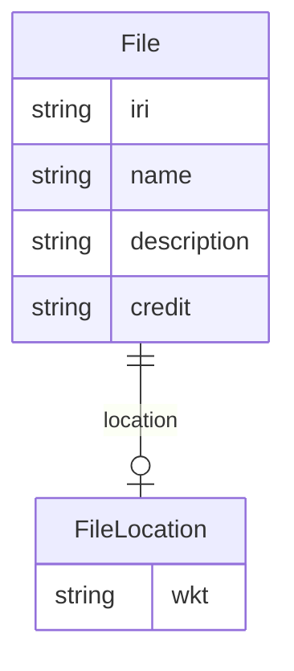

# Class: File


URI: [rfs:File](https://framework.regen.network/schema/File)





<!-- no inheritance hierarchy -->


## Slots

| Name | Cardinality and Range | Description | Inheritance |
| ---  | --- | --- | --- |
| [iri](iri.md) | 1 <br/> [String](String.md) |  | direct |
| [name](name.md) | 1 <br/> [String](String.md) |  | direct |
| [description](description.md) | 0..1 <br/> [String](String.md) |  | direct |
| [location](location.md) | 0..1 <br/> [FileLocation](FileLocation.md) |  | direct |
| [credit](credit.md) | 0..1 <br/> [String](String.md) |  | direct |


## Usages

| used by | used in | type | used |
| ---  | --- | --- | --- |
| [ProjectPost](ProjectPost.md) | [files](files.md) | range | [File](File.md) |


## Identifier and Mapping Information


### Schema Source


* from schema: https://framework.regen.network/schema/


## Mappings

| Mapping Type | Mapped Value |
| ---  | ---  |
| self | rfs:File |
| native | rfs:File |


## LinkML Source

<!-- TODO: investigate https://stackoverflow.com/questions/37606292/how-to-create-tabbed-code-blocks-in-mkdocs-or-sphinx -->

### Direct

<details>
```yaml
name: File
from_schema: https://framework.regen.network/schema/
attributes:
  iri:
    name: iri
    from_schema: https://framework.regen.network/schema/
    rank: 1000
    identifier: true
    domain_of:
    - File
    required: true
  name:
    name: name
    from_schema: https://framework.regen.network/schema/
    slot_uri: dcterms:title
    domain_of:
    - Project
    - ProjectRole
    - File
    required: true
  description:
    name: description
    from_schema: https://framework.regen.network/schema/
    slot_uri: dcterms:description
    domain_of:
    - Project
    - ProjectRole
    - File
  location:
    name: location
    from_schema: https://framework.regen.network/schema/
    rank: 1000
    slot_uri: geo:hasGeometry
    domain_of:
    - File
    range: FileLocation
  credit:
    name: credit
    from_schema: https://framework.regen.network/schema/
    rank: 1000
    slot_uri: dcterms:creator
    domain_of:
    - File

```
</details>

### Induced

<details>
```yaml
name: File
from_schema: https://framework.regen.network/schema/
attributes:
  iri:
    name: iri
    from_schema: https://framework.regen.network/schema/
    rank: 1000
    identifier: true
    alias: iri
    owner: File
    domain_of:
    - File
    range: string
    required: true
  name:
    name: name
    from_schema: https://framework.regen.network/schema/
    slot_uri: dcterms:title
    alias: name
    owner: File
    domain_of:
    - Project
    - ProjectRole
    - File
    range: string
    required: true
  description:
    name: description
    from_schema: https://framework.regen.network/schema/
    slot_uri: dcterms:description
    alias: description
    owner: File
    domain_of:
    - Project
    - ProjectRole
    - File
    range: string
  location:
    name: location
    from_schema: https://framework.regen.network/schema/
    rank: 1000
    slot_uri: geo:hasGeometry
    alias: location
    owner: File
    domain_of:
    - File
    range: FileLocation
  credit:
    name: credit
    from_schema: https://framework.regen.network/schema/
    rank: 1000
    slot_uri: dcterms:creator
    alias: credit
    owner: File
    domain_of:
    - File
    range: string

```
</details>