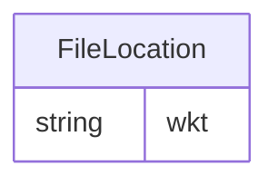

# Class: FileLocation


URI: [geo:Geometry](http://www.opengis.net/ont/geosparql#Geometry)





<!-- no inheritance hierarchy -->


## Slots

| Name | Cardinality and Range | Description | Inheritance |
| ---  | --- | --- | --- |
| [wkt](wkt.md) | 0..1 <br/> [String](String.md) |  | direct |


## Usages

| used by | used in | type | used |
| ---  | --- | --- | --- |
| [File](File.md) | [location](location.md) | range | [FileLocation](FileLocation.md) |


## Identifier and Mapping Information


### Schema Source


* from schema: https://framework.regen.network/schema/


## Mappings

| Mapping Type | Mapped Value |
| ---  | ---  |
| self | geo:Geometry |
| native | rfs:FileLocation |


## LinkML Source

<!-- TODO: investigate https://stackoverflow.com/questions/37606292/how-to-create-tabbed-code-blocks-in-mkdocs-or-sphinx -->

### Direct

<details>
```yaml
name: FileLocation
from_schema: https://framework.regen.network/schema/
attributes:
  wkt:
    name: wkt
    from_schema: https://framework.regen.network/schema/
    rank: 1000
    slot_uri: geo:asWKT
    domain_of:
    - FileLocation
class_uri: geo:Geometry

```
</details>

### Induced

<details>
```yaml
name: FileLocation
from_schema: https://framework.regen.network/schema/
attributes:
  wkt:
    name: wkt
    from_schema: https://framework.regen.network/schema/
    rank: 1000
    slot_uri: geo:asWKT
    alias: wkt
    owner: FileLocation
    domain_of:
    - FileLocation
    range: string
class_uri: geo:Geometry

```
</details>