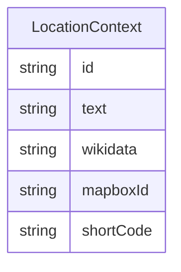

# Class: LocationContext


URI: [rfs:LocationContext](https://framework.regen.network/schema/LocationContext)





<!-- no inheritance hierarchy -->


## Slots

| Name | Cardinality and Range | Description | Inheritance |
| ---  | --- | --- | --- |
| [id](id.md) | 1 <br/> [String](String.md) |  | direct |
| [text](text.md) | 0..1 <br/> [String](String.md) |  | direct |
| [wikidata](wikidata.md) | 0..1 <br/> [String](String.md) |  | direct |
| [mapboxId](mapboxId.md) | 0..1 <br/> [String](String.md) |  | direct |
| [shortCode](shortCode.md) | 0..1 <br/> [String](String.md) |  | direct |


## Usages

| used by | used in | type | used |
| ---  | --- | --- | --- |
| [Location](Location.md) | [context](context.md) | range | [LocationContext](LocationContext.md) |


## Identifier and Mapping Information


### Schema Source


* from schema: https://framework.regen.network/schema/


## Mappings

| Mapping Type | Mapped Value |
| ---  | ---  |
| self | rfs:LocationContext |
| native | rfs:LocationContext |


## LinkML Source

<!-- TODO: investigate https://stackoverflow.com/questions/37606292/how-to-create-tabbed-code-blocks-in-mkdocs-or-sphinx -->

### Direct

<details>
```yaml
name: LocationContext
from_schema: https://framework.regen.network/schema/
attributes:
  id:
    name: id
    from_schema: https://framework.regen.network/schema/
    identifier: true
    domain_of:
    - Location
    - LocationContext
    range: string
    required: true
  text:
    name: text
    from_schema: https://framework.regen.network/schema/
    domain_of:
    - Location
    - LocationContext
    range: string
  wikidata:
    name: wikidata
    from_schema: https://framework.regen.network/schema/
    rank: 1000
    domain_of:
    - LocationContext
    range: string
    required: false
  mapboxId:
    name: mapboxId
    from_schema: https://framework.regen.network/schema/
    rank: 1000
    alias: mapbox_id
    domain_of:
    - LocationContext
    range: string
    required: false
  shortCode:
    name: shortCode
    from_schema: https://framework.regen.network/schema/
    rank: 1000
    alias: short_code
    domain_of:
    - LocationContext
    range: string
    required: false

```
</details>

### Induced

<details>
```yaml
name: LocationContext
from_schema: https://framework.regen.network/schema/
attributes:
  id:
    name: id
    from_schema: https://framework.regen.network/schema/
    identifier: true
    alias: id
    owner: LocationContext
    domain_of:
    - Location
    - LocationContext
    range: string
    required: true
  text:
    name: text
    from_schema: https://framework.regen.network/schema/
    alias: text
    owner: LocationContext
    domain_of:
    - Location
    - LocationContext
    range: string
  wikidata:
    name: wikidata
    from_schema: https://framework.regen.network/schema/
    rank: 1000
    alias: wikidata
    owner: LocationContext
    domain_of:
    - LocationContext
    range: string
    required: false
  mapboxId:
    name: mapboxId
    from_schema: https://framework.regen.network/schema/
    rank: 1000
    alias: mapbox_id
    owner: LocationContext
    domain_of:
    - LocationContext
    range: string
    required: false
  shortCode:
    name: shortCode
    from_schema: https://framework.regen.network/schema/
    rank: 1000
    alias: short_code
    owner: LocationContext
    domain_of:
    - LocationContext
    range: string
    required: false

```
</details>