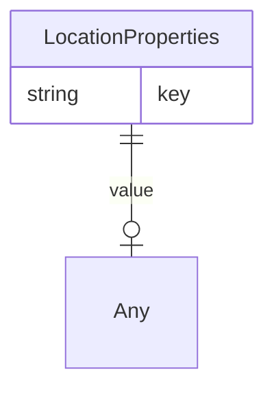

# Class: LocationProperties


URI: [rfs:LocationProperties](https://framework.regen.network/schema/LocationProperties)





<!-- no inheritance hierarchy -->


## Slots

| Name | Cardinality and Range | Description | Inheritance |
| ---  | --- | --- | --- |
| [key](key.md) | 0..1 <br/> [String](String.md) |  | direct |
| [value](value.md) | 0..1 <br/> [Any](Any.md) |  | direct |


## Usages

| used by | used in | type | used |
| ---  | --- | --- | --- |
| [Location](Location.md) | [properties](properties.md) | range | [LocationProperties](LocationProperties.md) |


## Identifier and Mapping Information


### Schema Source


* from schema: https://framework.regen.network/schema/


## Mappings

| Mapping Type | Mapped Value |
| ---  | ---  |
| self | rfs:LocationProperties |
| native | rfs:LocationProperties |


## LinkML Source

<!-- TODO: investigate https://stackoverflow.com/questions/37606292/how-to-create-tabbed-code-blocks-in-mkdocs-or-sphinx -->

### Direct

<details>
```yaml
name: LocationProperties
from_schema: https://framework.regen.network/schema/
attributes:
  key:
    name: key
    from_schema: https://framework.regen.network/schema/
    rank: 1000
    domain_of:
    - LocationProperties
    range: string
  value:
    name: value
    from_schema: https://framework.regen.network/schema/
    rank: 1000
    domain_of:
    - LocationProperties
    range: Any

```
</details>

### Induced

<details>
```yaml
name: LocationProperties
from_schema: https://framework.regen.network/schema/
attributes:
  key:
    name: key
    from_schema: https://framework.regen.network/schema/
    rank: 1000
    alias: key
    owner: LocationProperties
    domain_of:
    - LocationProperties
    range: string
  value:
    name: value
    from_schema: https://framework.regen.network/schema/
    rank: 1000
    alias: value
    owner: LocationProperties
    domain_of:
    - LocationProperties
    range: Any

```
</details>