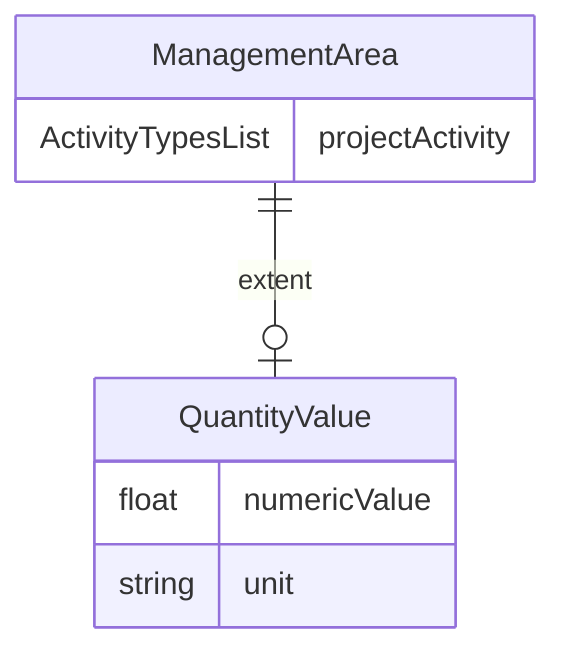

# Class: ManagementArea


URI: [rfs:ManagementArea](https://framework.regen.network/schema/ManagementArea)





<!-- no inheritance hierarchy -->


## Slots

| Name | Cardinality and Range | Description | Inheritance |
| ---  | --- | --- | --- |
| [projectActivity](projectActivity.md) | * <br/> [ActivityTypes](ActivityTypes.md) | the activity | direct |
| [extent](extent.md) | 0..1 <br/> [QuantityValue](QuantityValue.md) | the extent | direct |


## Usages

| used by | used in | type | used |
| ---  | --- | --- | --- |
| [TerrasosProjectInfo](TerrasosProjectInfo.md) | [managementAreas](managementAreas.md) | range | [ManagementArea](ManagementArea.md) |


## Identifier and Mapping Information


### Schema Source


* from schema: https://framework.regen.network/schema/


## Mappings

| Mapping Type | Mapped Value |
| ---  | ---  |
| self | rfs:ManagementArea |
| native | rfs:ManagementArea |


## LinkML Source

<!-- TODO: investigate https://stackoverflow.com/questions/37606292/how-to-create-tabbed-code-blocks-in-mkdocs-or-sphinx -->

### Direct

<details>
```yaml
name: ManagementArea
from_schema: https://framework.regen.network/schema/
attributes:
  projectActivity:
    name: projectActivity
    description: the activity
    from_schema: https://framework.regen.network/schema/
    rank: 1000
    slot_uri: rfs:projectActivity
    domain_of:
    - ManagementArea
    range: ActivityTypes
    multivalued: true
  extent:
    name: extent
    description: the extent
    from_schema: https://framework.regen.network/schema/
    rank: 1000
    slot_uri: dcterms:extent
    domain_of:
    - ManagementArea
    range: QuantityValue
class_uri: rfs:ManagementArea

```
</details>

### Induced

<details>
```yaml
name: ManagementArea
from_schema: https://framework.regen.network/schema/
attributes:
  projectActivity:
    name: projectActivity
    description: the activity
    from_schema: https://framework.regen.network/schema/
    rank: 1000
    slot_uri: rfs:projectActivity
    alias: projectActivity
    owner: ManagementArea
    domain_of:
    - ManagementArea
    range: ActivityTypes
    multivalued: true
  extent:
    name: extent
    description: the extent
    from_schema: https://framework.regen.network/schema/
    rank: 1000
    slot_uri: dcterms:extent
    alias: extent
    owner: ManagementArea
    domain_of:
    - ManagementArea
    range: QuantityValue
class_uri: rfs:ManagementArea

```
</details>