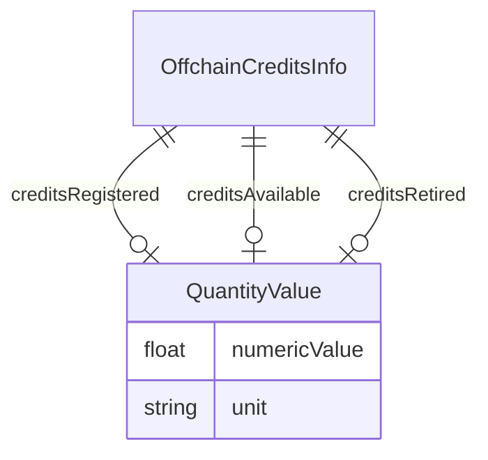

# Class: OffchainCreditsInfo


URI: [rfs:OffchainCreditsInfo](https://framework.regen.network/schema/OffchainCreditsInfo)





<!-- no inheritance hierarchy -->


## Slots

| Name | Cardinality and Range | Description | Inheritance |
| ---  | --- | --- | --- |
| [creditsRegistered](creditsRegistered.md) | 0..1 <br/> [QuantityValue](QuantityValue.md) | The number of credits registered | direct |
| [creditsAvailable](creditsAvailable.md) | 0..1 <br/> [QuantityValue](QuantityValue.md) | The number of credits available | direct |
| [creditsRetired](creditsRetired.md) | 0..1 <br/> [QuantityValue](QuantityValue.md) | The number of credits retired | direct |


## Usages

| used by | used in | type | used |
| ---  | --- | --- | --- |
| [Project](Project.md) | [offchainCreditsInfo](offchainCreditsInfo.md) | range | [OffchainCreditsInfo](OffchainCreditsInfo.md) |


## Identifier and Mapping Information


### Schema Source


* from schema: https://framework.regen.network/schema/


## Mappings

| Mapping Type | Mapped Value |
| ---  | ---  |
| self | rfs:OffchainCreditsInfo |
| native | rfs:OffchainCreditsInfo |


## LinkML Source

<!-- TODO: investigate https://stackoverflow.com/questions/37606292/how-to-create-tabbed-code-blocks-in-mkdocs-or-sphinx -->

### Direct

<details>
```yaml
name: OffchainCreditsInfo
from_schema: https://framework.regen.network/schema/
attributes:
  creditsRegistered:
    name: creditsRegistered
    description: The number of credits registered
    from_schema: https://framework.regen.network/schema/
    rank: 1000
    domain_of:
    - OffchainCreditsInfo
    range: QuantityValue
  creditsAvailable:
    name: creditsAvailable
    description: The number of credits available
    from_schema: https://framework.regen.network/schema/
    rank: 1000
    domain_of:
    - OffchainCreditsInfo
    range: QuantityValue
  creditsRetired:
    name: creditsRetired
    description: The number of credits retired
    from_schema: https://framework.regen.network/schema/
    rank: 1000
    domain_of:
    - OffchainCreditsInfo
    range: QuantityValue
class_uri: rfs:OffchainCreditsInfo

```
</details>

### Induced

<details>
```yaml
name: OffchainCreditsInfo
from_schema: https://framework.regen.network/schema/
attributes:
  creditsRegistered:
    name: creditsRegistered
    description: The number of credits registered
    from_schema: https://framework.regen.network/schema/
    rank: 1000
    alias: creditsRegistered
    owner: OffchainCreditsInfo
    domain_of:
    - OffchainCreditsInfo
    range: QuantityValue
  creditsAvailable:
    name: creditsAvailable
    description: The number of credits available
    from_schema: https://framework.regen.network/schema/
    rank: 1000
    alias: creditsAvailable
    owner: OffchainCreditsInfo
    domain_of:
    - OffchainCreditsInfo
    range: QuantityValue
  creditsRetired:
    name: creditsRetired
    description: The number of credits retired
    from_schema: https://framework.regen.network/schema/
    rank: 1000
    alias: creditsRetired
    owner: OffchainCreditsInfo
    domain_of:
    - OffchainCreditsInfo
    range: QuantityValue
class_uri: rfs:OffchainCreditsInfo

```
</details>