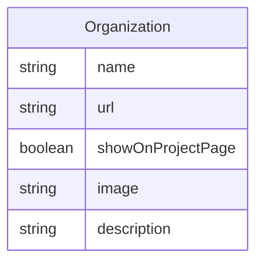

# Class: Organization


URI: [rfs:Organization](https://framework.regen.network/schema/Organization)





<!-- no inheritance hierarchy -->


## Slots

| Name | Cardinality and Range | Description | Inheritance |
| ---  | --- | --- | --- |
| [name](name.md) | 1 <br/> [String](String.md) | Name of the project | direct |
| [url](url.md) | 0..1 <br/> [String](String.md) |  | direct |
| [showOnProjectPage](showOnProjectPage.md) | 0..1 <br/> [Boolean](Boolean.md) | Whether to show this organization or individual on the project page | direct |
| [image](image.md) | 0..1 <br/> [String](String.md) |  | direct |
| [description](description.md) | 0..1 <br/> [String](String.md) | A description of the organization | direct |


## Usages

| used by | used in | type | used |
| ---  | --- | --- | --- |
| [TerrasosProjectInfo](TerrasosProjectInfo.md) | [environmentalAuthority](environmentalAuthority.md) | range | [Organization](Organization.md) |


## Identifier and Mapping Information


### Schema Source


* from schema: https://framework.regen.network/schema/


## Mappings

| Mapping Type | Mapped Value |
| ---  | ---  |
| self | rfs:Organization |
| native | rfs:Organization |


## LinkML Source

<!-- TODO: investigate https://stackoverflow.com/questions/37606292/how-to-create-tabbed-code-blocks-in-mkdocs-or-sphinx -->

### Direct

<details>
```yaml
name: Organization
from_schema: https://framework.regen.network/schema/
slots:
- name
- url
- showOnProjectPage
- image
attributes:
  description:
    name: description
    description: A description of the organization.
    from_schema: https://framework.regen.network/schema/
    domain_of:
    - ProjectInfo
    - ProjectRole
    - Organization
    - File
    range: string
class_uri: rfs:Organization

```
</details>

### Induced

<details>
```yaml
name: Organization
from_schema: https://framework.regen.network/schema/
attributes:
  description:
    name: description
    description: A description of the organization.
    from_schema: https://framework.regen.network/schema/
    alias: description
    owner: Organization
    domain_of:
    - ProjectInfo
    - ProjectRole
    - Organization
    - File
    range: string
  name:
    name: name
    description: Name of the project.
    from_schema: https://framework.regen.network/schema/
    rank: 1000
    slot_uri: schema:name
    alias: name
    owner: Organization
    domain_of:
    - ProjectInfo
    - ProjectRole
    - Organization
    - File
    - AdministrativeArea
    range: string
    required: true
  url:
    name: url
    from_schema: https://framework.regen.network/schema/
    rank: 1000
    slot_uri: schema:URL
    alias: url
    owner: Organization
    domain_of:
    - ProjectRole
    - Organization
    - AdministrativeArea
    range: string
  showOnProjectPage:
    name: showOnProjectPage
    description: Whether to show this organization or individual on the project page.
    from_schema: https://framework.regen.network/schema/
    rank: 1000
    alias: showOnProjectPage
    owner: Organization
    domain_of:
    - Organization
    range: boolean
  image:
    name: image
    from_schema: https://framework.regen.network/schema/
    rank: 1000
    slot_uri: schema:image
    alias: image
    owner: Organization
    domain_of:
    - ProjectRole
    - Organization
    range: string
class_uri: rfs:Organization

```
</details>