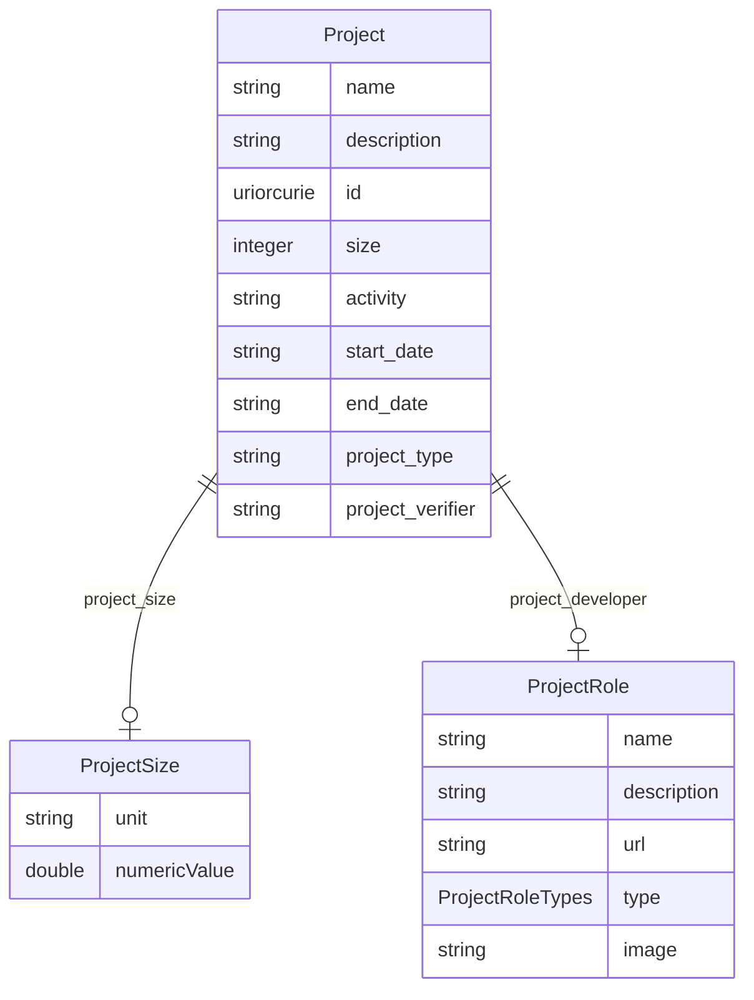

# Class: Project


URI: [rfs:Project](https://framework.regen.network/schema/Project)





<!-- no inheritance hierarchy -->


## Slots

| Name | Cardinality and Range | Description | Inheritance |
| ---  | --- | --- | --- |
| [name](name.md) | 1 <br/> [String](String.md) | Name of the project | direct |
| [description](description.md) | 0..1 <br/> [String](String.md) | Optional description of the project | direct |
| [project_size](project_size.md) | 0..1 <br/> [ProjectSize](ProjectSize.md) |  | direct |
| [project_developer](project_developer.md) | 0..1 <br/> [ProjectRole](ProjectRole.md) |  | direct |
| [id](id.md) | 1 <br/> [Uriorcurie](Uriorcurie.md) |  | direct |
| [size](size.md) | 0..1 <br/> [Integer](Integer.md) |  | direct |
| [activity](activity.md) | 0..1 <br/> [String](String.md) |  | direct |
| [start_date](start_date.md) | 0..1 <br/> [String](String.md) |  | direct |
| [end_date](end_date.md) | 0..1 <br/> [String](String.md) |  | direct |
| [project_type](project_type.md) | 0..1 <br/> [String](String.md) |  | direct |
| [project_verifier](project_verifier.md) | 0..1 <br/> [String](String.md) |  | direct |


## Identifier and Mapping Information


### Schema Source


* from schema: https://framework.regen.network/schema/


## Mappings

| Mapping Type | Mapped Value |
| ---  | ---  |
| self | rfs:Project |
| native | rfs:Project |


## LinkML Source

<!-- TODO: investigate https://stackoverflow.com/questions/37606292/how-to-create-tabbed-code-blocks-in-mkdocs-or-sphinx -->

### Direct

<details>
```yaml
name: Project
from_schema: https://framework.regen.network/schema/
slots:
- name
- description
- project_size
- project_developer
attributes:
  id:
    name: id
    from_schema: https://framework.regen.network/schema/
    rank: 1000
    identifier: true
    domain_of:
    - Project
    range: uriorcurie
    required: true
  size:
    name: size
    from_schema: https://framework.regen.network/schema/
    rank: 1000
    domain_of:
    - Project
    range: integer
  activity:
    name: activity
    from_schema: https://framework.regen.network/schema/
    rank: 1000
    domain_of:
    - Project
  start_date:
    name: start_date
    from_schema: https://framework.regen.network/schema/
    rank: 1000
    domain_of:
    - Project
  end_date:
    name: end_date
    from_schema: https://framework.regen.network/schema/
    rank: 1000
    domain_of:
    - Project
  project_type:
    name: project_type
    from_schema: https://framework.regen.network/schema/
    rank: 1000
    domain_of:
    - Project
  project_verifier:
    name: project_verifier
    from_schema: https://framework.regen.network/schema/
    rank: 1000
    domain_of:
    - Project
class_uri: rfs:Project

```
</details>

### Induced

<details>
```yaml
name: Project
from_schema: https://framework.regen.network/schema/
attributes:
  id:
    name: id
    from_schema: https://framework.regen.network/schema/
    rank: 1000
    identifier: true
    alias: id
    owner: Project
    domain_of:
    - Project
    range: uriorcurie
    required: true
  size:
    name: size
    from_schema: https://framework.regen.network/schema/
    rank: 1000
    alias: size
    owner: Project
    domain_of:
    - Project
    range: integer
  activity:
    name: activity
    from_schema: https://framework.regen.network/schema/
    rank: 1000
    alias: activity
    owner: Project
    domain_of:
    - Project
    range: string
  start_date:
    name: start_date
    from_schema: https://framework.regen.network/schema/
    rank: 1000
    alias: start_date
    owner: Project
    domain_of:
    - Project
    range: string
  end_date:
    name: end_date
    from_schema: https://framework.regen.network/schema/
    rank: 1000
    alias: end_date
    owner: Project
    domain_of:
    - Project
    range: string
  project_type:
    name: project_type
    from_schema: https://framework.regen.network/schema/
    rank: 1000
    alias: project_type
    owner: Project
    domain_of:
    - Project
    range: string
  project_verifier:
    name: project_verifier
    from_schema: https://framework.regen.network/schema/
    rank: 1000
    alias: project_verifier
    owner: Project
    domain_of:
    - Project
    range: string
  name:
    name: name
    description: Name of the project.
    from_schema: https://framework.regen.network/schema/
    rank: 1000
    slot_uri: schema:name
    alias: name
    owner: Project
    domain_of:
    - Project
    - ProjectRole
    - File
    range: string
    required: true
  description:
    name: description
    description: Optional description of the project.
    from_schema: https://framework.regen.network/schema/
    rank: 1000
    slot_uri: schema:description
    alias: description
    owner: Project
    domain_of:
    - Project
    - ProjectRole
    - File
    range: string
  project_size:
    name: project_size
    from_schema: https://framework.regen.network/schema/
    rank: 1000
    alias: project_size
    owner: Project
    domain_of:
    - Project
    range: ProjectSize
    inlined: false
  project_developer:
    name: project_developer
    from_schema: https://framework.regen.network/schema/
    rank: 1000
    alias: project_developer
    owner: Project
    domain_of:
    - Project
    range: ProjectRole
    inlined: false
class_uri: rfs:Project

```
</details>