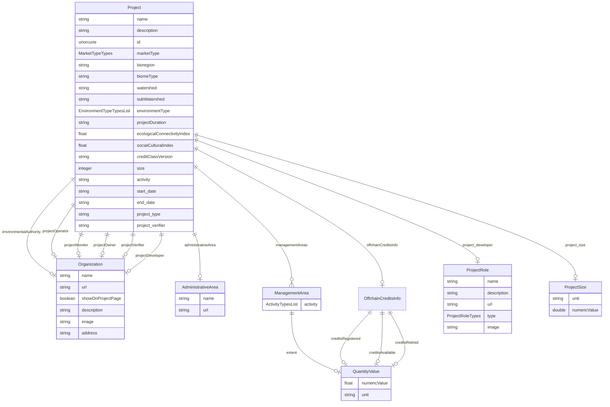

# Class: Project


URI: [rfs:Project](https://framework.regen.network/schema/Project)





<!-- no inheritance hierarchy -->


## Slots

| Name | Cardinality and Range | Description | Inheritance |
| ---  | --- | --- | --- |
| [name](name.md) | 1 <br/> [String](String.md) | Name of the project | direct |
| [description](description.md) | 0..1 <br/> [String](String.md) | Optional description of the project | direct |
| [project_size](project_size.md) | 0..1 <br/> [ProjectSize](ProjectSize.md) |  | direct |
| [project_developer](project_developer.md) | 0..1 <br/> [ProjectRole](ProjectRole.md) |  | direct |
| [id](id.md) | 1 <br/> [Uriorcurie](Uriorcurie.md) |  | direct |
| [environmentalAuthority](environmentalAuthority.md) | 0..1 <br/> [Organization](Organization.md) | The environmental authority associated with the project | direct |
| [marketType](marketType.md) | 0..1 <br/> [MarketTypeTypes](MarketTypeTypes.md) | The type of market for the associated credits | direct |
| [bioregion](bioregion.md) | 0..1 <br/> [String](String.md) | The bioregion associated with the project | direct |
| [biomeType](biomeType.md) | 0..1 <br/> [String](String.md) | The type of biome associated with the project | direct |
| [watershed](watershed.md) | 0..1 <br/> [String](String.md) | The watershed associated with the project | direct |
| [subWatershed](subWatershed.md) | 0..1 <br/> [String](String.md) | The sub-watershed associated with the project | direct |
| [environmentType](environmentType.md) | * <br/> [EnvironmentTypeTypes](EnvironmentTypeTypes.md) | The type of environment associated with the project | direct |
| [offchainCreditsInfo](offchainCreditsInfo.md) | 0..1 <br/> [OffchainCreditsInfo](OffchainCreditsInfo.md) | Information about offchain credits associated with the project | direct |
| [projectDuration](projectDuration.md) | 0..1 <br/> [String](String.md) | The duration of the project | direct |
| [managementAreas](managementAreas.md) | * <br/> [ManagementArea](ManagementArea.md) | The management areas associated with the project | direct |
| [ecologicalConnectivityIndex](ecologicalConnectivityIndex.md) | 0..1 <br/> [Float](Float.md) | The ecological connectivity index of the project | direct |
| [socialCulturalIndex](socialCulturalIndex.md) | 0..1 <br/> [Float](Float.md) | The social cultural index of the project | direct |
| [administrativeArea](administrativeArea.md) | 0..1 <br/> [AdministrativeArea](AdministrativeArea.md) | The administrative area associated with the project | direct |
| [projectOperator](projectOperator.md) | 0..1 <br/> [Organization](Organization.md) | The organization responsible for operating the project | direct |
| [projectMonitor](projectMonitor.md) | 0..1 <br/> [Organization](Organization.md) | The organization responsible for monitoring the project | direct |
| [projectOwner](projectOwner.md) | 0..1 <br/> [Organization](Organization.md) | The organization responsible for owning the project | direct |
| [projectVerifier](projectVerifier.md) | 0..1 <br/> [Organization](Organization.md) | The organization responsible for owning the project | direct |
| [projectDeveloper](projectDeveloper.md) | 0..1 <br/> [Organization](Organization.md) | The organization responsible for owning the project | direct |
| [creditClassVersion](creditClassVersion.md) | 0..1 <br/> [String](String.md) | The version of the credit class used for the project | direct |
| [size](size.md) | 0..1 <br/> [Integer](Integer.md) |  | direct |
| [activity](activity.md) | 0..1 <br/> [String](String.md) |  | direct |
| [start_date](start_date.md) | 0..1 <br/> [String](String.md) |  | direct |
| [end_date](end_date.md) | 0..1 <br/> [String](String.md) |  | direct |
| [project_type](project_type.md) | 0..1 <br/> [String](String.md) |  | direct |
| [project_verifier](project_verifier.md) | 0..1 <br/> [String](String.md) |  | direct |


## Identifier and Mapping Information


### Schema Source


* from schema: https://framework.regen.network/schema/


## Mappings

| Mapping Type | Mapped Value |
| ---  | ---  |
| self | rfs:Project |
| native | rfs:Project |


## LinkML Source

<!-- TODO: investigate https://stackoverflow.com/questions/37606292/how-to-create-tabbed-code-blocks-in-mkdocs-or-sphinx -->

### Direct

<details>
```yaml
name: Project
from_schema: https://framework.regen.network/schema/
slots:
- name
- description
- project_size
- project_developer
- id
- environmentalAuthority
- marketType
- bioregion
- biomeType
- watershed
- subWatershed
- environmentType
- offchainCreditsInfo
- projectDuration
- managementAreas
- ecologicalConnectivityIndex
- socialCulturalIndex
- administrativeArea
- projectOperator
- projectMonitor
- projectOwner
- projectVerifier
- projectDeveloper
- creditClassVersion
attributes:
  size:
    name: size
    from_schema: https://framework.regen.network/schema/
    rank: 1000
    domain_of:
    - Project
    range: integer
  activity:
    name: activity
    from_schema: https://framework.regen.network/schema/
    domain_of:
    - Project
    - ManagementArea
  start_date:
    name: start_date
    from_schema: https://framework.regen.network/schema/
    rank: 1000
    domain_of:
    - Project
  end_date:
    name: end_date
    from_schema: https://framework.regen.network/schema/
    rank: 1000
    domain_of:
    - Project
  project_type:
    name: project_type
    from_schema: https://framework.regen.network/schema/
    rank: 1000
    domain_of:
    - Project
  project_verifier:
    name: project_verifier
    from_schema: https://framework.regen.network/schema/
    rank: 1000
    domain_of:
    - Project
class_uri: rfs:Project

```
</details>

### Induced

<details>
```yaml
name: Project
from_schema: https://framework.regen.network/schema/
attributes:
  size:
    name: size
    from_schema: https://framework.regen.network/schema/
    rank: 1000
    alias: size
    owner: Project
    domain_of:
    - Project
    range: integer
  activity:
    name: activity
    from_schema: https://framework.regen.network/schema/
    alias: activity
    owner: Project
    domain_of:
    - Project
    - ManagementArea
    range: string
  start_date:
    name: start_date
    from_schema: https://framework.regen.network/schema/
    rank: 1000
    alias: start_date
    owner: Project
    domain_of:
    - Project
    range: string
  end_date:
    name: end_date
    from_schema: https://framework.regen.network/schema/
    rank: 1000
    alias: end_date
    owner: Project
    domain_of:
    - Project
    range: string
  project_type:
    name: project_type
    from_schema: https://framework.regen.network/schema/
    rank: 1000
    alias: project_type
    owner: Project
    domain_of:
    - Project
    range: string
  project_verifier:
    name: project_verifier
    from_schema: https://framework.regen.network/schema/
    rank: 1000
    alias: project_verifier
    owner: Project
    domain_of:
    - Project
    range: string
  name:
    name: name
    description: Name of the project.
    from_schema: https://framework.regen.network/schema/
    rank: 1000
    slot_uri: schema:name
    alias: name
    owner: Project
    domain_of:
    - Project
    - ProjectRole
    - Organization
    - AdministrativeArea
    - File
    range: string
    required: true
  description:
    name: description
    description: Optional description of the project.
    from_schema: https://framework.regen.network/schema/
    rank: 1000
    slot_uri: schema:description
    alias: description
    owner: Project
    domain_of:
    - Project
    - ProjectRole
    - Organization
    - File
    range: string
  project_size:
    name: project_size
    from_schema: https://framework.regen.network/schema/
    rank: 1000
    alias: project_size
    owner: Project
    domain_of:
    - Project
    range: ProjectSize
    inlined: false
  project_developer:
    name: project_developer
    from_schema: https://framework.regen.network/schema/
    rank: 1000
    alias: project_developer
    owner: Project
    domain_of:
    - Project
    range: ProjectRole
    inlined: false
  id:
    name: id
    from_schema: https://framework.regen.network/schema/
    rank: 1000
    identifier: true
    alias: id
    owner: Project
    domain_of:
    - Project
    range: uriorcurie
    required: true
  environmentalAuthority:
    name: environmentalAuthority
    description: The environmental authority associated with the project.
    from_schema: https://framework.regen.network/schema/
    rank: 1000
    slot_uri: rfs:environmentalAuthority
    alias: environmentalAuthority
    owner: Project
    domain_of:
    - Project
    range: Organization
  marketType:
    name: marketType
    description: The type of market for the associated credits.
    from_schema: https://framework.regen.network/schema/
    rank: 1000
    slot_uri: rfs:marketType
    alias: marketType
    owner: Project
    domain_of:
    - Project
    range: MarketTypeTypes
  bioregion:
    name: bioregion
    description: The bioregion associated with the project.
    from_schema: https://framework.regen.network/schema/
    rank: 1000
    slot_uri: rfs:bioregion
    alias: bioregion
    owner: Project
    domain_of:
    - Project
    range: string
  biomeType:
    name: biomeType
    description: The type of biome associated with the project.
    from_schema: https://framework.regen.network/schema/
    rank: 1000
    slot_uri: rfs:biomeType
    alias: biomeType
    owner: Project
    domain_of:
    - Project
    range: string
  watershed:
    name: watershed
    description: The watershed associated with the project.
    from_schema: https://framework.regen.network/schema/
    rank: 1000
    slot_uri: rfs:watershed
    alias: watershed
    owner: Project
    domain_of:
    - Project
    range: string
  subWatershed:
    name: subWatershed
    description: The sub-watershed associated with the project.
    from_schema: https://framework.regen.network/schema/
    rank: 1000
    slot_uri: rfs:subWatershed
    alias: subWatershed
    owner: Project
    domain_of:
    - Project
    range: string
  environmentType:
    name: environmentType
    description: The type of environment associated with the project.
    from_schema: https://framework.regen.network/schema/
    rank: 1000
    slot_uri: rfs:environmentType
    alias: environmentType
    owner: Project
    domain_of:
    - Project
    range: EnvironmentTypeTypes
    multivalued: true
  offchainCreditsInfo:
    name: offchainCreditsInfo
    description: Information about offchain credits associated with the project.
    from_schema: https://framework.regen.network/schema/
    rank: 1000
    slot_uri: rfs:offchainCreditsInfo
    alias: offchainCreditsInfo
    owner: Project
    domain_of:
    - Project
    range: OffchainCreditsInfo
  projectDuration:
    name: projectDuration
    description: The duration of the project.
    from_schema: https://framework.regen.network/schema/
    rank: 1000
    slot_uri: rfs:projectDuration
    alias: projectDuration
    owner: Project
    domain_of:
    - Project
    range: string
  managementAreas:
    name: managementAreas
    description: The management areas associated with the project.
    from_schema: https://framework.regen.network/schema/
    rank: 1000
    slot_uri: rfs:managementAreas
    alias: managementAreas
    owner: Project
    domain_of:
    - Project
    range: ManagementArea
    multivalued: true
    inlined: true
  ecologicalConnectivityIndex:
    name: ecologicalConnectivityIndex
    description: The ecological connectivity index of the project.
    from_schema: https://framework.regen.network/schema/
    rank: 1000
    slot_uri: rfs:ecologicalConnectivityIndex
    alias: ecologicalConnectivityIndex
    owner: Project
    domain_of:
    - Project
    range: float
  socialCulturalIndex:
    name: socialCulturalIndex
    description: The social cultural index of the project.
    from_schema: https://framework.regen.network/schema/
    rank: 1000
    slot_uri: rfs:socialCulturalIndex
    alias: socialCulturalIndex
    owner: Project
    domain_of:
    - Project
    range: float
  administrativeArea:
    name: administrativeArea
    description: The administrative area associated with the project.
    from_schema: https://framework.regen.network/schema/
    rank: 1000
    alias: administrativeArea
    owner: Project
    domain_of:
    - Project
    range: AdministrativeArea
  projectOperator:
    name: projectOperator
    description: The organization responsible for operating the project.
    from_schema: https://framework.regen.network/schema/
    rank: 1000
    slot_uri: rfs:projectOperator
    alias: projectOperator
    owner: Project
    domain_of:
    - Project
    range: Organization
  projectMonitor:
    name: projectMonitor
    description: The organization responsible for monitoring the project.
    from_schema: https://framework.regen.network/schema/
    rank: 1000
    slot_uri: rfs:projectMonitor
    alias: projectMonitor
    owner: Project
    domain_of:
    - Project
    range: Organization
  projectOwner:
    name: projectOwner
    description: The organization responsible for owning the project.
    from_schema: https://framework.regen.network/schema/
    rank: 1000
    slot_uri: rfs:projectOwner
    alias: projectOwner
    owner: Project
    domain_of:
    - Project
    range: Organization
  projectVerifier:
    name: projectVerifier
    description: The organization responsible for owning the project.
    from_schema: https://framework.regen.network/schema/
    rank: 1000
    slot_uri: rfs:projectVerifier
    alias: projectVerifier
    owner: Project
    domain_of:
    - Project
    range: Organization
  projectDeveloper:
    name: projectDeveloper
    description: The organization responsible for owning the project.
    from_schema: https://framework.regen.network/schema/
    rank: 1000
    slot_uri: rfs:projectDeveloper
    alias: projectDeveloper
    owner: Project
    domain_of:
    - Project
    range: Organization
  creditClassVersion:
    name: creditClassVersion
    description: The version of the credit class used for the project.
    from_schema: https://framework.regen.network/schema/
    rank: 1000
    slot_uri: rfs:creditClassVersion
    alias: creditClassVersion
    owner: Project
    domain_of:
    - Project
    range: string
class_uri: rfs:Project

```
</details>