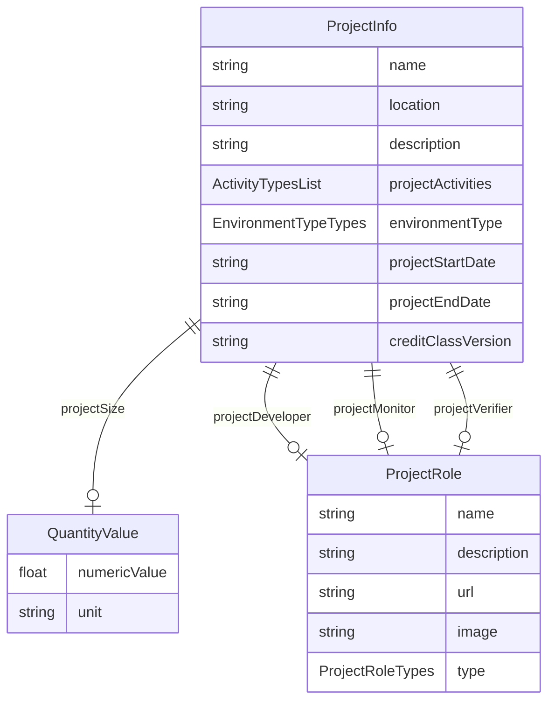

# Class: ProjectInfo


URI: [rfs:ProjectInfo](https://framework.regen.network/schema/ProjectInfo)





## Inheritance
* **ProjectInfo**
    * [TerrasosProjectInfo](TerrasosProjectInfo.md)


## Slots

| Name | Cardinality and Range | Description | Inheritance |
| ---  | --- | --- | --- |
| [name](name.md) | 1..1 <br/> [String](String.md) | Name of the project | direct |
| [location](location.md) | 1..1 <br/> [String](String.md) | The location of the project | direct |
| [description](description.md) | 1..1 <br/> [String](String.md) | Optional description of the project | direct |
| [projectActivities](projectActivities.md) | 0..* <br/> [ActivityTypes](ActivityTypes.md) | the activity | direct |
| [projectSize](projectSize.md) | 0..1 <br/> [QuantityValue](QuantityValue.md) |  | direct |
| [projectDeveloper](projectDeveloper.md) | 0..1 <br/> [ProjectRole](ProjectRole.md) | The organization responsible for owning the project | direct |
| [environmentType](environmentType.md) | 0..1 <br/> [EnvironmentTypeTypes](EnvironmentTypeTypes.md) | The environment type of the project | direct |
| [projectMonitor](projectMonitor.md) | 0..1 <br/> [ProjectRole](ProjectRole.md) | The organization responsible for monitoring the project | direct |
| [projectVerifier](projectVerifier.md) | 0..1 <br/> [ProjectRole](ProjectRole.md) | The organization responsible for owning the project | direct |
| [projectStartDate](projectStartDate.md) | 0..1 <br/> [String](String.md) | The start date of the project | direct |
| [projectEndDate](projectEndDate.md) | 0..1 <br/> [String](String.md) | The end date of the project | direct |
| [creditClassVersion](creditClassVersion.md) | 0..1 <br/> [String](String.md) | The version of the credit class used for the project | direct |


## Identifier and Mapping Information


### Schema Source


* from schema: https://framework.regen.network/schema/


## Mappings

| Mapping Type | Mapped Value |
| ---  | ---  |
| self | rfs:ProjectInfo |
| native | rfs:ProjectInfo |


## LinkML Source

<!-- TODO: investigate https://stackoverflow.com/questions/37606292/how-to-create-tabbed-code-blocks-in-mkdocs-or-sphinx -->

### Direct

<details>
```yaml
name: ProjectInfo
from_schema: https://framework.regen.network/schema/
slots:
- name
- location
- description
- projectActivities
- projectSize
- projectDeveloper
- environmentType
- projectMonitor
- projectVerifier
- projectStartDate
- projectEndDate
- creditClassVersion
class_uri: rfs:ProjectInfo
tree_root: true

```
</details>

### Induced

<details>
```yaml
name: ProjectInfo
from_schema: https://framework.regen.network/schema/
attributes:
  name:
    name: name
    description: Name of the project.
    from_schema: https://framework.regen.network/schema/
    rank: 1000
    slot_uri: schema:name
    alias: name
    owner: ProjectInfo
    domain_of:
    - ProjectInfo
    - ProjectRole
    - Organization
    - File
    - AdministrativeArea
    range: string
    required: true
  location:
    name: location
    description: The location of the project.
    from_schema: https://framework.regen.network/schema/
    rank: 1000
    slot_uri: schema:location
    alias: location
    owner: ProjectInfo
    domain_of:
    - ProjectInfo
    - File
    range: string
    required: true
  description:
    name: description
    description: Optional description of the project.
    from_schema: https://framework.regen.network/schema/
    rank: 1000
    slot_uri: schema:description
    alias: description
    owner: ProjectInfo
    domain_of:
    - ProjectInfo
    - ProjectRole
    - Organization
    - File
    range: string
    required: true
  projectActivities:
    name: projectActivities
    description: the activity.
    from_schema: https://framework.regen.network/schema/
    rank: 1000
    slot_uri: rfs:projectActivities
    multivalued: true
    alias: projectActivities
    owner: ProjectInfo
    domain_of:
    - ProjectInfo
    range: ActivityTypes
  projectSize:
    name: projectSize
    from_schema: https://framework.regen.network/schema/
    rank: 1000
    alias: projectSize
    owner: ProjectInfo
    domain_of:
    - ProjectInfo
    range: QuantityValue
    inlined: false
  projectDeveloper:
    name: projectDeveloper
    description: The organization responsible for owning the project.
    from_schema: https://framework.regen.network/schema/
    rank: 1000
    slot_uri: rfs:projectDeveloper
    alias: projectDeveloper
    owner: ProjectInfo
    domain_of:
    - ProjectInfo
    range: ProjectRole
  environmentType:
    name: environmentType
    description: The environment type of the project.
    from_schema: https://framework.regen.network/schema/
    rank: 1000
    slot_uri: rfs:environmentType
    alias: environmentType
    owner: ProjectInfo
    domain_of:
    - ProjectInfo
    range: EnvironmentTypeTypes
  projectMonitor:
    name: projectMonitor
    description: The organization responsible for monitoring the project.
    from_schema: https://framework.regen.network/schema/
    rank: 1000
    slot_uri: rfs:projectMonitor
    alias: projectMonitor
    owner: ProjectInfo
    domain_of:
    - ProjectInfo
    range: ProjectRole
  projectVerifier:
    name: projectVerifier
    description: The organization responsible for owning the project.
    from_schema: https://framework.regen.network/schema/
    rank: 1000
    slot_uri: rfs:projectVerifier
    alias: projectVerifier
    owner: ProjectInfo
    domain_of:
    - ProjectInfo
    range: ProjectRole
  projectStartDate:
    name: projectStartDate
    description: The start date of the project.
    from_schema: https://framework.regen.network/schema/
    rank: 1000
    slot_uri: xsd:date
    alias: projectStartDate
    owner: ProjectInfo
    domain_of:
    - ProjectInfo
    range: string
  projectEndDate:
    name: projectEndDate
    description: The end date of the project.
    from_schema: https://framework.regen.network/schema/
    rank: 1000
    slot_uri: xsd:date
    alias: projectEndDate
    owner: ProjectInfo
    domain_of:
    - ProjectInfo
    range: string
  creditClassVersion:
    name: creditClassVersion
    description: The version of the credit class used for the project.
    from_schema: https://framework.regen.network/schema/
    rank: 1000
    slot_uri: rfs:creditClassVersion
    alias: creditClassVersion
    owner: ProjectInfo
    domain_of:
    - ProjectInfo
    range: string
class_uri: rfs:ProjectInfo
tree_root: true

```
</details>