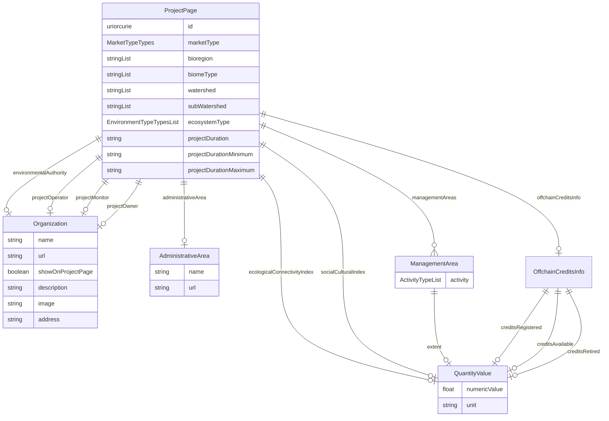

# Class: ProjectPage


URI: [rfs:ProjectPage](https://framework.regen.network/schema/ProjectPage)





<!-- no inheritance hierarchy -->


## Slots

| Name | Cardinality and Range | Description | Inheritance |
| ---  | --- | --- | --- |
| [id](id.md) | 1 <br/> [Uriorcurie](Uriorcurie.md) |  | direct |
| [environmentalAuthority](environmentalAuthority.md) | 0..1 <br/> [Organization](Organization.md) | The environmental authority associated with the project | direct |
| [marketType](marketType.md) | 0..1 <br/> [MarketTypeTypes](MarketTypeTypes.md) | The type of market for the associated credits | direct |
| [bioregion](bioregion.md) | * <br/> [String](String.md) | The bioregion associated with the project | direct |
| [biomeType](biomeType.md) | * <br/> [String](String.md) | The type of biome associated with the project | direct |
| [watershed](watershed.md) | * <br/> [String](String.md) | The watershed associated with the project | direct |
| [subWatershed](subWatershed.md) | * <br/> [String](String.md) | The sub-watershed associated with the project | direct |
| [ecosystemType](ecosystemType.md) | * <br/> [EnvironmentTypeTypes](EnvironmentTypeTypes.md) | The type of ecosystem associated with the project | direct |
| [offchainCreditsInfo](offchainCreditsInfo.md) | 0..1 <br/> [OffchainCreditsInfo](OffchainCreditsInfo.md) | Information about offchain credits associated with the project | direct |
| [projectDuration](projectDuration.md) | 0..1 <br/> [String](String.md) | The duration of the project | direct |
| [projectDurationMinimum](projectDurationMinimum.md) | 0..1 <br/> [String](String.md) | The minimum possible duration for a project | direct |
| [projectDurationMaximum](projectDurationMaximum.md) | 0..1 <br/> [String](String.md) | The maximum possible duration for a project | direct |
| [managementAreas](managementAreas.md) | * <br/> [ManagementArea](ManagementArea.md) | The management areas associated with the project | direct |
| [ecologicalConnectivityIndex](ecologicalConnectivityIndex.md) | 0..1 <br/> [QuantityValue](QuantityValue.md) | The ecological connectivity index of the project | direct |
| [socialCulturalIndex](socialCulturalIndex.md) | 0..1 <br/> [QuantityValue](QuantityValue.md) | The social cultural index of the project | direct |
| [administrativeArea](administrativeArea.md) | 0..1 <br/> [AdministrativeArea](AdministrativeArea.md) | The administrative area associated with the project | direct |
| [projectOperator](projectOperator.md) | 0..1 <br/> [Organization](Organization.md) | The organization responsible for operating the project | direct |
| [projectMonitor](projectMonitor.md) | 0..1 <br/> [Organization](Organization.md) | The organization responsible for monitoring the project | direct |
| [projectOwner](projectOwner.md) | 0..1 <br/> [Organization](Organization.md) | The organization responsible for owning the project | direct |


## Identifier and Mapping Information


### Schema Source


* from schema: https://framework.regen.network/schema/


## Mappings

| Mapping Type | Mapped Value |
| ---  | ---  |
| self | rfs:ProjectPage |
| native | rfs:ProjectPage |


## LinkML Source

<!-- TODO: investigate https://stackoverflow.com/questions/37606292/how-to-create-tabbed-code-blocks-in-mkdocs-or-sphinx -->

### Direct

<details>
```yaml
name: ProjectPage
from_schema: https://framework.regen.network/schema/
slots:
- id
- environmentalAuthority
- marketType
- bioregion
- biomeType
- watershed
- subWatershed
- ecosystemType
- offchainCreditsInfo
- projectDuration
- projectDurationMinimum
- projectDurationMaximum
- managementAreas
- ecologicalConnectivityIndex
- socialCulturalIndex
- administrativeArea
- projectOperator
- projectMonitor
- projectOwner
class_uri: rfs:ProjectPage
tree_root: true

```
</details>

### Induced

<details>
```yaml
name: ProjectPage
from_schema: https://framework.regen.network/schema/
attributes:
  id:
    name: id
    from_schema: https://framework.regen.network/schema/
    rank: 1000
    identifier: true
    alias: id
    owner: ProjectPage
    domain_of:
    - Project
    - ProjectPage
    range: uriorcurie
    required: true
  environmentalAuthority:
    name: environmentalAuthority
    description: The environmental authority associated with the project.
    from_schema: https://framework.regen.network/schema/
    rank: 1000
    slot_uri: rfs:environmentalAuthority
    alias: environmentalAuthority
    owner: ProjectPage
    domain_of:
    - ProjectPage
    range: Organization
  marketType:
    name: marketType
    description: The type of market for the associated credits.
    from_schema: https://framework.regen.network/schema/
    rank: 1000
    slot_uri: rfs:marketType
    alias: marketType
    owner: ProjectPage
    domain_of:
    - ProjectPage
    range: MarketTypeTypes
  bioregion:
    name: bioregion
    description: The bioregion associated with the project.
    from_schema: https://framework.regen.network/schema/
    rank: 1000
    slot_uri: rfs:bioregion
    alias: bioregion
    owner: ProjectPage
    domain_of:
    - ProjectPage
    range: string
    multivalued: true
  biomeType:
    name: biomeType
    description: The type of biome associated with the project.
    from_schema: https://framework.regen.network/schema/
    rank: 1000
    slot_uri: rfs:biomeType
    alias: biomeType
    owner: ProjectPage
    domain_of:
    - ProjectPage
    range: string
    multivalued: true
  watershed:
    name: watershed
    description: The watershed associated with the project.
    from_schema: https://framework.regen.network/schema/
    rank: 1000
    slot_uri: rfs:watershed
    alias: watershed
    owner: ProjectPage
    domain_of:
    - ProjectPage
    range: string
    multivalued: true
  subWatershed:
    name: subWatershed
    description: The sub-watershed associated with the project.
    from_schema: https://framework.regen.network/schema/
    rank: 1000
    slot_uri: rfs:subWatershed
    alias: subWatershed
    owner: ProjectPage
    domain_of:
    - ProjectPage
    range: string
    multivalued: true
  ecosystemType:
    name: ecosystemType
    description: The type of ecosystem associated with the project.
    from_schema: https://framework.regen.network/schema/
    rank: 1000
    slot_uri: rfs:ecosystemType
    alias: ecosystemType
    owner: ProjectPage
    domain_of:
    - ProjectPage
    range: EnvironmentTypeTypes
    multivalued: true
  offchainCreditsInfo:
    name: offchainCreditsInfo
    description: Information about offchain credits associated with the project.
    from_schema: https://framework.regen.network/schema/
    rank: 1000
    slot_uri: rfs:offchainCreditsInfo
    alias: offchainCreditsInfo
    owner: ProjectPage
    domain_of:
    - ProjectPage
    range: OffchainCreditsInfo
  projectDuration:
    name: projectDuration
    description: The duration of the project.
    from_schema: https://framework.regen.network/schema/
    rank: 1000
    slot_uri: rfs:projectDuration
    alias: projectDuration
    owner: ProjectPage
    domain_of:
    - ProjectPage
    range: string
  projectDurationMinimum:
    name: projectDurationMinimum
    description: The minimum possible duration for a project.
    from_schema: https://framework.regen.network/schema/
    rank: 1000
    slot_uri: rfs:projectDurationMinimum
    alias: projectDurationMinimum
    owner: ProjectPage
    domain_of:
    - ProjectPage
    range: string
  projectDurationMaximum:
    name: projectDurationMaximum
    description: The maximum possible duration for a project.
    from_schema: https://framework.regen.network/schema/
    rank: 1000
    slot_uri: rfs:projectDurationMaximum
    alias: projectDurationMaximum
    owner: ProjectPage
    domain_of:
    - ProjectPage
    range: string
  managementAreas:
    name: managementAreas
    description: The management areas associated with the project.
    from_schema: https://framework.regen.network/schema/
    rank: 1000
    slot_uri: rfs:managementAreas
    alias: managementAreas
    owner: ProjectPage
    domain_of:
    - ProjectPage
    range: ManagementArea
    multivalued: true
    inlined: true
  ecologicalConnectivityIndex:
    name: ecologicalConnectivityIndex
    description: The ecological connectivity index of the project.
    from_schema: https://framework.regen.network/schema/
    rank: 1000
    slot_uri: rfs:ecologicalConnectivityIndex
    alias: ecologicalConnectivityIndex
    owner: ProjectPage
    domain_of:
    - ProjectPage
    range: QuantityValue
  socialCulturalIndex:
    name: socialCulturalIndex
    description: The social cultural index of the project.
    from_schema: https://framework.regen.network/schema/
    rank: 1000
    slot_uri: rfs:socialCulturalIndex
    alias: socialCulturalIndex
    owner: ProjectPage
    domain_of:
    - ProjectPage
    range: QuantityValue
  administrativeArea:
    name: administrativeArea
    description: The administrative area associated with the project.
    from_schema: https://framework.regen.network/schema/
    rank: 1000
    alias: administrativeArea
    owner: ProjectPage
    domain_of:
    - ProjectPage
    range: AdministrativeArea
  projectOperator:
    name: projectOperator
    description: The organization responsible for operating the project.
    from_schema: https://framework.regen.network/schema/
    rank: 1000
    slot_uri: rfs:projectOperator
    alias: projectOperator
    owner: ProjectPage
    domain_of:
    - ProjectPage
    range: Organization
  projectMonitor:
    name: projectMonitor
    description: The organization responsible for monitoring the project.
    from_schema: https://framework.regen.network/schema/
    rank: 1000
    slot_uri: rfs:projectMonitor
    alias: projectMonitor
    owner: ProjectPage
    domain_of:
    - ProjectPage
    range: Organization
  projectOwner:
    name: projectOwner
    description: The organization responsible for owning the project.
    from_schema: https://framework.regen.network/schema/
    rank: 1000
    slot_uri: rfs:projectOwner
    alias: projectOwner
    owner: ProjectPage
    domain_of:
    - ProjectPage
    range: Organization
class_uri: rfs:ProjectPage
tree_root: true

```
</details>