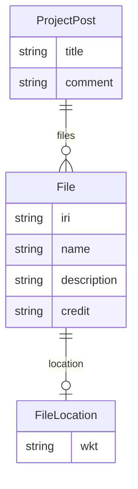

# Class: ProjectPost


URI: [rfs:ProjectPost](https://framework.regen.network/schema/ProjectPost)





<!-- no inheritance hierarchy -->


## Slots

| Name | Cardinality and Range | Description | Inheritance |
| ---  | --- | --- | --- |
| [title](title.md) | 1 <br/> [String](String.md) |  | direct |
| [comment](comment.md) | 0..1 <br/> [String](String.md) |  | direct |
| [files](files.md) | * <br/> [File](File.md) |  | direct |


## Identifier and Mapping Information


### Schema Source


* from schema: https://framework.regen.network/schema/


## Mappings

| Mapping Type | Mapped Value |
| ---  | ---  |
| self | rfs:ProjectPost |
| native | rfs:ProjectPost |


## LinkML Source

<!-- TODO: investigate https://stackoverflow.com/questions/37606292/how-to-create-tabbed-code-blocks-in-mkdocs-or-sphinx -->

### Direct

<details>
```yaml
name: ProjectPost
from_schema: https://framework.regen.network/schema/
attributes:
  title:
    name: title
    from_schema: https://framework.regen.network/schema/
    rank: 1000
    slot_uri: dcterms:title
    domain_of:
    - ProjectPost
    required: true
  comment:
    name: comment
    from_schema: https://framework.regen.network/schema/
    rank: 1000
    slot_uri: dcterms:description
    domain_of:
    - ProjectPost
  files:
    name: files
    from_schema: https://framework.regen.network/schema/
    rank: 1000
    slot_uri: dcterms:references
    list_elements_ordered: true
    domain_of:
    - ProjectPost
    range: File
    multivalued: true
    inlined: true
    inlined_as_list: true

```
</details>

### Induced

<details>
```yaml
name: ProjectPost
from_schema: https://framework.regen.network/schema/
attributes:
  title:
    name: title
    from_schema: https://framework.regen.network/schema/
    rank: 1000
    slot_uri: dcterms:title
    alias: title
    owner: ProjectPost
    domain_of:
    - ProjectPost
    range: string
    required: true
  comment:
    name: comment
    from_schema: https://framework.regen.network/schema/
    rank: 1000
    slot_uri: dcterms:description
    alias: comment
    owner: ProjectPost
    domain_of:
    - ProjectPost
    range: string
  files:
    name: files
    from_schema: https://framework.regen.network/schema/
    rank: 1000
    slot_uri: dcterms:references
    list_elements_ordered: true
    alias: files
    owner: ProjectPost
    domain_of:
    - ProjectPost
    range: File
    multivalued: true
    inlined: true
    inlined_as_list: true

```
</details>