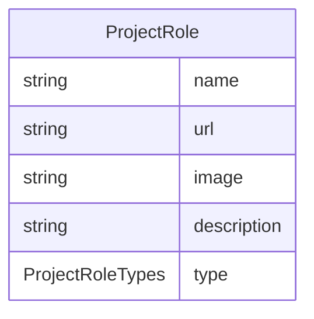

# Class: ProjectRole


URI: [rfs:ProjectRole](https://framework.regen.network/schema/ProjectRole)





<!-- no inheritance hierarchy -->


## Slots

| Name | Cardinality and Range | Description | Inheritance |
| ---  | --- | --- | --- |
| [name](name.md) | 1 <br/> [String](String.md) | Name of the project | direct |
| [url](url.md) | 0..1 <br/> [String](String.md) |  | direct |
| [image](image.md) | 0..1 <br/> [String](String.md) |  | direct |
| [description](description.md) | 0..1 <br/> [String](String.md) |  | direct |
| [type](type.md) | 1 <br/> [ProjectRoleTypes](ProjectRoleTypes.md) |  | direct |


## Usages

| used by | used in | type | used |
| ---  | --- | --- | --- |
| [ProjectInfo](ProjectInfo.md) | [projectDeveloper](projectDeveloper.md) | range | [ProjectRole](ProjectRole.md) |
| [ProjectInfo](ProjectInfo.md) | [projectMonitor](projectMonitor.md) | range | [ProjectRole](ProjectRole.md) |
| [ProjectInfo](ProjectInfo.md) | [projectVerifier](projectVerifier.md) | range | [ProjectRole](ProjectRole.md) |
| [TerrasosProjectInfo](TerrasosProjectInfo.md) | [projectOperator](projectOperator.md) | range | [ProjectRole](ProjectRole.md) |
| [TerrasosProjectInfo](TerrasosProjectInfo.md) | [projectOwner](projectOwner.md) | range | [ProjectRole](ProjectRole.md) |
| [TerrasosProjectInfo](TerrasosProjectInfo.md) | [projectDeveloper](projectDeveloper.md) | range | [ProjectRole](ProjectRole.md) |
| [TerrasosProjectInfo](TerrasosProjectInfo.md) | [projectMonitor](projectMonitor.md) | range | [ProjectRole](ProjectRole.md) |
| [TerrasosProjectInfo](TerrasosProjectInfo.md) | [projectVerifier](projectVerifier.md) | range | [ProjectRole](ProjectRole.md) |


## Identifier and Mapping Information


### Schema Source


* from schema: https://framework.regen.network/schema/


## Mappings

| Mapping Type | Mapped Value |
| ---  | ---  |
| self | rfs:ProjectRole |
| native | rfs:ProjectRole |


## LinkML Source

<!-- TODO: investigate https://stackoverflow.com/questions/37606292/how-to-create-tabbed-code-blocks-in-mkdocs-or-sphinx -->

### Direct

<details>
```yaml
name: ProjectRole
from_schema: https://framework.regen.network/schema/
slots:
- name
- url
- image
attributes:
  description:
    name: description
    from_schema: https://framework.regen.network/schema/
    domain_of:
    - ProjectInfo
    - ProjectRole
    - Organization
    - File
    range: string
  type:
    name: type
    from_schema: https://framework.regen.network/schema/
    rank: 1000
    slot_uri: rfs:ProjectRoleType
    domain_of:
    - ProjectRole
    - Location
    - Geometry
    range: ProjectRoleTypes
    required: true

```
</details>

### Induced

<details>
```yaml
name: ProjectRole
from_schema: https://framework.regen.network/schema/
attributes:
  description:
    name: description
    from_schema: https://framework.regen.network/schema/
    alias: description
    owner: ProjectRole
    domain_of:
    - ProjectInfo
    - ProjectRole
    - Organization
    - File
    range: string
  type:
    name: type
    from_schema: https://framework.regen.network/schema/
    rank: 1000
    slot_uri: rfs:ProjectRoleType
    alias: type
    owner: ProjectRole
    domain_of:
    - ProjectRole
    - Location
    - Geometry
    range: ProjectRoleTypes
    required: true
  name:
    name: name
    description: Name of the project.
    from_schema: https://framework.regen.network/schema/
    rank: 1000
    slot_uri: schema:name
    alias: name
    owner: ProjectRole
    domain_of:
    - ProjectInfo
    - ProjectRole
    - Organization
    - File
    - AdministrativeArea
    range: string
    required: true
  url:
    name: url
    from_schema: https://framework.regen.network/schema/
    rank: 1000
    slot_uri: schema:URL
    alias: url
    owner: ProjectRole
    domain_of:
    - ProjectRole
    - Organization
    - AdministrativeArea
    range: string
  image:
    name: image
    from_schema: https://framework.regen.network/schema/
    rank: 1000
    slot_uri: schema:image
    alias: image
    owner: ProjectRole
    domain_of:
    - ProjectRole
    - Organization
    range: string

```
</details>