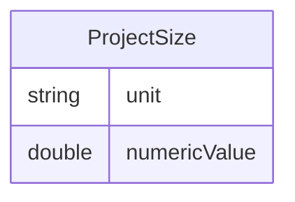

# Class: ProjectSize


URI: [rfs:ProjectSize](https://framework.regen.network/schema/ProjectSize)





<!-- no inheritance hierarchy -->


## Slots

| Name | Cardinality and Range | Description | Inheritance |
| ---  | --- | --- | --- |
| [unit](unit.md) | 1 <br/> [String](String.md) |  | direct |
| [numericValue](numericValue.md) | 1 <br/> [Double](Double.md) |  | direct |


## Usages

| used by | used in | type | used |
| ---  | --- | --- | --- |
| [Project](Project.md) | [project_size](project_size.md) | range | [ProjectSize](ProjectSize.md) |


## Identifier and Mapping Information


### Schema Source


* from schema: https://framework.regen.network/schema/


## Mappings

| Mapping Type | Mapped Value |
| ---  | ---  |
| self | rfs:ProjectSize |
| native | rfs:ProjectSize |


## LinkML Source

<!-- TODO: investigate https://stackoverflow.com/questions/37606292/how-to-create-tabbed-code-blocks-in-mkdocs-or-sphinx -->

### Direct

<details>
```yaml
name: ProjectSize
from_schema: https://framework.regen.network/schema/
attributes:
  unit:
    name: unit
    from_schema: https://framework.regen.network/schema/
    rank: 1000
    slot_uri: qudt:unit
    domain_of:
    - ProjectSize
    - QuantityValue
    required: true
  numericValue:
    name: numericValue
    from_schema: https://framework.regen.network/schema/
    rank: 1000
    slot_uri: qudt:numericValue
    domain_of:
    - ProjectSize
    - QuantityValue
    range: double
    required: true
class_uri: rfs:ProjectSize

```
</details>

### Induced

<details>
```yaml
name: ProjectSize
from_schema: https://framework.regen.network/schema/
attributes:
  unit:
    name: unit
    from_schema: https://framework.regen.network/schema/
    rank: 1000
    slot_uri: qudt:unit
    alias: unit
    owner: ProjectSize
    domain_of:
    - ProjectSize
    - QuantityValue
    range: string
    required: true
  numericValue:
    name: numericValue
    from_schema: https://framework.regen.network/schema/
    rank: 1000
    slot_uri: qudt:numericValue
    alias: numericValue
    owner: ProjectSize
    domain_of:
    - ProjectSize
    - QuantityValue
    range: double
    required: true
class_uri: rfs:ProjectSize

```
</details>