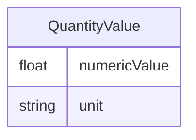

# Class: QuantityValue


_A value that represents a quantity, with a numeric value and a unit._


URI: [qudt:QuantityValue](http://qudt.org/schema/qudt/QuantityValue)





<!-- no inheritance hierarchy -->


## Slots

| Name | Cardinality and Range | Description | Inheritance |
| ---  | --- | --- | --- |
| [numericValue](numericValue.md) | 0..1 <br/> [Float](Float.md) | The numeric value of the quantity | direct |
| [unit](unit.md) | 0..1 <br/> [String](String.md) | The unit of measurement for the quantity | direct |


## Usages

| used by | used in | type | used |
| ---  | --- | --- | --- |
| [ProjectPage](ProjectPage.md) | [ecologicalConnectivityIndex](ecologicalConnectivityIndex.md) | range | [QuantityValue](QuantityValue.md) |
| [ProjectPage](ProjectPage.md) | [socialCulturalIndex](socialCulturalIndex.md) | range | [QuantityValue](QuantityValue.md) |
| [OffchainCreditsInfo](OffchainCreditsInfo.md) | [creditsRegistered](creditsRegistered.md) | range | [QuantityValue](QuantityValue.md) |
| [OffchainCreditsInfo](OffchainCreditsInfo.md) | [creditsAvailable](creditsAvailable.md) | range | [QuantityValue](QuantityValue.md) |
| [OffchainCreditsInfo](OffchainCreditsInfo.md) | [creditsRetired](creditsRetired.md) | range | [QuantityValue](QuantityValue.md) |
| [ManagementArea](ManagementArea.md) | [extent](extent.md) | range | [QuantityValue](QuantityValue.md) |


## Identifier and Mapping Information


### Schema Source


* from schema: https://framework.regen.network/schema/


## Mappings

| Mapping Type | Mapped Value |
| ---  | ---  |
| self | qudt:QuantityValue |
| native | rfs:QuantityValue |


## LinkML Source

<!-- TODO: investigate https://stackoverflow.com/questions/37606292/how-to-create-tabbed-code-blocks-in-mkdocs-or-sphinx -->

### Direct

<details>
```yaml
name: QuantityValue
description: A value that represents a quantity, with a numeric value and a unit.
from_schema: https://framework.regen.network/schema/
attributes:
  numericValue:
    name: numericValue
    description: The numeric value of the quantity.
    from_schema: https://framework.regen.network/schema/
    slot_uri: qudt:numericValue
    domain_of:
    - ProjectSize
    - QuantityValue
    range: float
  unit:
    name: unit
    description: The unit of measurement for the quantity.
    from_schema: https://framework.regen.network/schema/
    slot_uri: qudt:unit
    domain_of:
    - ProjectSize
    - QuantityValue
    range: string
class_uri: qudt:QuantityValue

```
</details>

### Induced

<details>
```yaml
name: QuantityValue
description: A value that represents a quantity, with a numeric value and a unit.
from_schema: https://framework.regen.network/schema/
attributes:
  numericValue:
    name: numericValue
    description: The numeric value of the quantity.
    from_schema: https://framework.regen.network/schema/
    slot_uri: qudt:numericValue
    alias: numericValue
    owner: QuantityValue
    domain_of:
    - ProjectSize
    - QuantityValue
    range: float
  unit:
    name: unit
    description: The unit of measurement for the quantity.
    from_schema: https://framework.regen.network/schema/
    slot_uri: qudt:unit
    alias: unit
    owner: QuantityValue
    domain_of:
    - ProjectSize
    - QuantityValue
    range: string
class_uri: qudt:QuantityValue

```
</details>